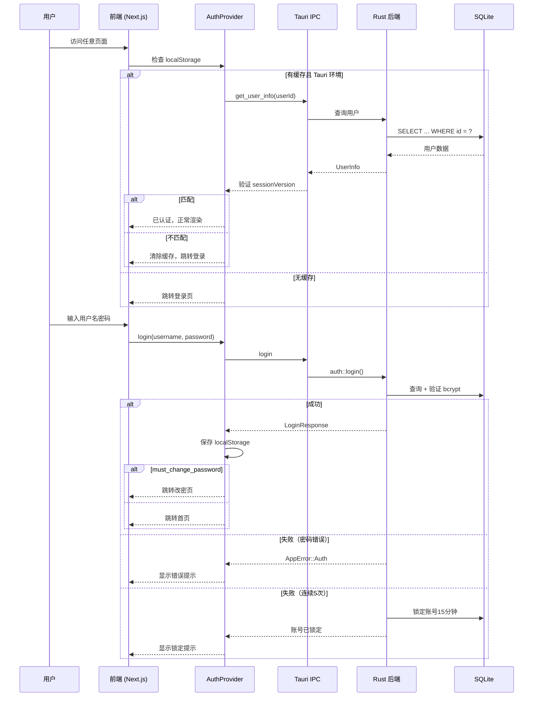

# 云枢 (CloudPivot IMS)

> **项目代号**：云枢 (CloudPivot IMS)

> **工厂所在地**：🇻🇳 越南

> **文档版本**：v1.6

> **更新日期**：2026-04-07

## 文档索引

| #   | 文档                                      | 核心内容                                                                  |
| --- | ----------------------------------------- | ------------------------------------------------------------------------- |
| 1   | [需求规格说明书](docs/01-requirements.md) | 项目背景、系统架构、**12 大功能模块**详细设计（含权限矩阵、财务闭环规则） |
| 2   | [数据库设计](docs/02-database-design.md)  | ER 关系图、**45 张表** DDL、迁移策略                                      |
| 3   | [界面原型设计](docs/03-ui-prototype.md)   | 整体布局、**30 个页面** wireframe、交互规范、全量页面地图                 |
| 4   | [开发计划](docs/04-development-plan.md)   | 甘特图、**5 个开发阶段**任务清单、技术风险                                |

## 快速概览

**一句话描述**：面向越南家具生产工厂的桌面端进销存管理系统，支持多语言（中/越/英）、多币种（VND/CNY/USD）、轻量批次追溯、定制单管理、智能补货等核心业务。

**技术栈**：Tauri 2 + Next.js 16 + TypeScript + shadcn/ui + Tailwind CSS 4 + SQLite

**目标平台**：Windows 10/11、macOS

**预估工期**：32–36 周（5 个迭代阶段，含联调与回归缓冲）

**范围边界**：`v1.0` 提供业务单据、库存、报表、打印与基础财务辅助能力，不替代专业财务软件，也不等同于越南法定税务/发票系统。

## 功能模块一览

```
📊 首页看板 — KPI 指标、趋势图、待办事项、补货提醒
📦 基础数据 — 物料管理、分类管理、供应商、客户、仓库、单位管理
📋 BOM — 物料清单、成本核算、需求展算
🛒 采购管理 — 采购单（含运费/关税）、采购入库、采购退货
💰 销售管理 — 销售单、销售出库、销售退货
🏭 库存管理 — 库存查询、出入库流水、盘点、调拨、预警、批次追溯
🎨 定制单管理 — 非标定制单、定制配置、成本核算、生产跟踪
📦 智能补货 — 补货建议、消耗趋势、一键生成采购单
💳 财务管理 — 应付账款、应收账款、收付款登记（多币种）
📈 报表中心 — 采购报表、销售报表、库存报表、标准/实际毛利分析
⚙️ 系统设置 — 企业信息、编码规则、库存规则、数据备份、汇率管理
🌐 国际化 — 中/越/英三语切换、VND/CNY/USD 多币种
🖨️ 打印模板 — 9 种固定单据模板、多语言/双语打印、PDF 导出
```

## 技术架构

```
┌─────────────────────────────────────────────┐
│               Tauri 2 Shell                 │
├──────────────────┬──────────────────────────┤
│   Next.js 16     │     Rust Backend         │
│   (SSG 前端)     │     (核心逻辑)            │
│                  │                          │
│  ┌────────────┐  │  ┌────────────────────┐  │
│  │ shadcn/ui  │  │  │ IPC Commands       │  │
│  │ + Tailwind │◄─┼──┤ (login, ping, ...) │  │
│  └────────────┘  │  └────────┬───────────┘  │
│  ┌────────────┐  │  ┌────────┴───────────┐  │
│  │ AuthProvider│  │  │ Auth Module        │  │
│  │ (路由守卫)  │  │  │ (bcrypt + session) │  │
│  └────────────┘  │  └────────┬───────────┘  │
│  ┌────────────┐  │  ┌────────┴───────────┐  │
│  │ lib/tauri  │  │  │ DB Module          │  │
│  │ (IPC 封装) │  │  │ (SQLite + 迁移)    │  │
│  └────────────┘  │  └────────────────────┘  │
├──────────────────┴──────────────────────────┤
│              SQLite (WAL Mode)              │
│         45 张表 · 轻量级迁移引擎            │
└─────────────────────────────────────────────┘
```

## 认证流程

系统采用 bcrypt 密码哈希 + session_version 会话校验机制，支持连续失败锁定和首次登录强制改密。



### 安全设计要点

| 机制 | 说明 |
|------|------|
| **密码存储** | bcrypt 哈希（cost = 12），数据库不存储明文 |
| **连续失败锁定** | 连续 5 次错误 → 账号锁定 15 分钟 |
| **首次改密** | `must_change_password` 标记，强制跳转改密页 |
| **会话版本** | `session_version` 字段，改密后递增，旧会话自动失效 |
| **默认密码防御** | 改密时禁止使用初始密码 `admin123` |
| **环境降级** | 非 Tauri 开发环境自动使用 mock 数据，不影响 UI 开发 |

## 项目结构

```
app/                        # Next.js App Router（SSG）
  [locale]/                 # i18n 路由（next-intl）
    login/page.tsx          # 登录页
    change-password/page.tsx # 首次改密页
    page.tsx                # 首页看板
    {模块名}/page.tsx       # 业务页面
components/
  ui/                       # shadcn/ui 组件（base-nova 风格）
  layout/                   # 布局组件：AppLayout、Sidebar、Header
  providers/                # ThemeProvider、AuthProvider
  common/                   # 通用组件
config/nav.ts               # 侧边栏导航树
i18n/                       # next-intl 配置
messages/{zh,vi,en}.json    # 三语翻译文件
lib/
  tauri.ts                  # Tauri IPC 封装
  currency.ts               # 多币种格式化工具
  types/system-config.ts    # 系统配置类型定义
  utils.ts                  # cn() 工具函数
src-tauri/                  # Rust 后端
  src/
    lib.rs                  # 应用入口（日志 + DB + 命令注册）
    auth.rs                 # 认证模块（bcrypt + 锁定 + 改密）
    error.rs                # 统一错误类型
    db/mod.rs               # SQLite 连接池 + PRAGMA
    db/migration.rs         # 轻量级迁移引擎
    commands/mod.rs         # IPC 命令定义
  migrations/sqlite/
    001_init.sql            # 45 张表 DDL + 索引
    002_seed_data.sql       # 系统配置 + 汇率 + 计量单位
docs/                       # 设计文档（约 6000 行）
```

## 开发命令

```bash
pnpm dev                    # Next.js 开发服务器（Turbopack，端口 3000）
pnpm build                  # Next.js SSG 构建（输出到 ./out/）
pnpm tauri dev              # Tauri 全栈开发（自动启动 pnpm dev）
pnpm tauri build            # 生产构建（SSG + Rust 编译 + 安装包）
pnpm lint                   # ESLint 检查
pnpm format                 # Prettier 格式化
pnpm typecheck              # tsc --noEmit（严格模式）
pnpm shadcn add <组件名>    # 安装 shadcn/ui 组件
```

## 当前进度

**阶段一**（基础框架）：✅ 已完成

- [x] 项目脚手架 — Tauri 2 + Next.js 16 + shadcn/ui
- [x] 国际化框架 — next-intl 三语切换
- [x] 布局组件 — 侧边栏 + 顶栏 + 语言/主题切换
- [x] 首页看板 — KPI 卡片 + 图表（mock 数据）
- [x] 深浅主题 — CSS 变量 + next-themes
- [x] Rust 数据库层 — SQLite 连接池 + 迁移引擎 + 45 张表
- [x] IPC 通信层 — ping / db_version / 认证命令
- [x] 用户认证 — bcrypt + 锁定 + 改密 + AuthProvider + 路由守卫
- [x] 前端工具库 — 多币种格式化 + 系统配置类型

**阶段二**（核心业务）：⬜ 未开始
