# 云枢 (CloudPivot IMS) — 数据库设计

> **版本**：v1.4 &nbsp;|&nbsp; **日期**：2026-03-30

---

## 1. ER 关系总览

```mermaid
erDiagram
    %% ── 基础模块 ──
    CATEGORIES ||--o{ MATERIALS : "分类包含"
    UNITS ||--o{ MATERIALS : "作为计量单位"
    SUPPLIERS ||--o{ SUPPLIER_MATERIALS : "供应物料"
    MATERIALS ||--o{ SUPPLIER_MATERIALS : "被供应"

    %% ── BOM 模块 ──
    MATERIALS ||--o{ BOM : "成品BOM"
    BOM ||--o{ BOM_ITEMS : "包含"
    MATERIALS ||--o{ BOM_ITEMS : "作为子物料"

    %% ── 采购模块 ──
    SUPPLIERS ||--o{ PURCHASE_ORDERS : "供应"
    PURCHASE_ORDERS ||--o{ PURCHASE_ORDER_ITEMS : "包含明细"
    MATERIALS ||--o{ PURCHASE_ORDER_ITEMS : "被采购"
    PURCHASE_ORDERS ||--o{ INBOUND_ORDERS : "生成入库"
    INBOUND_ORDERS ||--o{ INBOUND_ORDER_ITEMS : "包含明细"
    INBOUND_ORDER_ITEMS ||--o{ PURCHASE_RETURN_ITEMS : "可退货来源"
    INVENTORY_LOTS ||--o{ PURCHASE_RETURN_ITEMS : "退货批次"
    INBOUND_ORDERS ||--o{ PURCHASE_RETURNS : "退货来源"
    PURCHASE_RETURNS ||--o{ PURCHASE_RETURN_ITEMS : "包含明细"

    %% ── 销售模块 ──
    CUSTOMERS ||--o{ SALES_ORDERS : "购买"
    SALES_ORDERS ||--o{ SALES_ORDER_ITEMS : "包含明细"
    MATERIALS ||--o{ SALES_ORDER_ITEMS : "被销售"
    SALES_ORDERS ||--o{ OUTBOUND_ORDERS : "生成出库"
    OUTBOUND_ORDERS ||--o{ OUTBOUND_ORDER_ITEMS : "包含明细"
    INVENTORY_LOTS ||--o{ OUTBOUND_ORDER_ITEMS : "出库批次"
    OUTBOUND_ORDER_ITEMS ||--o{ SALES_RETURN_ITEMS : "可退货来源"
    INVENTORY_LOTS ||--o{ SALES_RETURN_ITEMS : "销售退货批次"
    OUTBOUND_ORDERS ||--o{ SALES_RETURNS : "退货来源"
    SALES_RETURNS ||--o{ SALES_RETURN_ITEMS : "包含明细"

    %% ── 库存模块 ──
    WAREHOUSES ||--o{ DEFAULT_WAREHOUSES : "默认仓映射"
    WAREHOUSES ||--o{ INVENTORY : "存储"
    MATERIALS ||--o{ INVENTORY : "有库存"
    MATERIALS ||--o{ INVENTORY_LOTS : "批次库存"
    WAREHOUSES ||--o{ INVENTORY_LOTS : "批次所在仓"
    INBOUND_ORDER_ITEMS ||--o{ INVENTORY_LOTS : "生成批次"
    MATERIALS ||--o{ INVENTORY_RESERVATIONS : "被预留"
    WAREHOUSES ||--o{ INVENTORY_RESERVATIONS : "预留仓库"
    INVENTORY_RESERVATIONS ||--o{ INVENTORY_RESERVATION_LOTS : "分配批次"
    INVENTORY_LOTS ||--o{ INVENTORY_RESERVATION_LOTS : "被预留"
    INVENTORY_LOTS ||--o{ INVENTORY_TRANSACTIONS : "批次流水"
    WAREHOUSES ||--o{ INVENTORY_TRANSACTIONS : "变动仓库"
    MATERIALS ||--o{ INVENTORY_TRANSACTIONS : "产生流水"
    INVENTORY_LOTS ||--o{ STOCK_CHECK_ITEMS : "盘点批次"
    WAREHOUSES ||--o{ STOCK_CHECKS : "盘点仓库"
    STOCK_CHECKS ||--o{ STOCK_CHECK_ITEMS : "包含明细"
    INVENTORY_LOTS ||--o{ TRANSFER_ITEMS : "调拨批次"
    WAREHOUSES ||--o{ TRANSFERS : "调出"
    TRANSFERS ||--o{ TRANSFER_ITEMS : "包含明细"

    %% ── 财务模块 ──
    SUPPLIERS ||--o{ PAYABLES : "应付"
    INBOUND_ORDERS ||--o{ PAYABLES : "生成应付"
    PAYABLES ||--o{ PAYMENT_RECORDS : "付款"
    CUSTOMERS ||--o{ RECEIVABLES : "应收"
    OUTBOUND_ORDERS ||--o{ RECEIVABLES : "生成应收"
    RECEIVABLES ||--o{ RECEIPT_RECORDS : "收款"

    %% ── 定制单模块 ──
    CUSTOMERS ||--o{ CUSTOM_ORDERS : "定制"
    CUSTOM_ORDERS ||--o{ CUSTOM_ORDER_ITEMS : "配置明细"
    CUSTOM_ORDERS ||--o{ INVENTORY_RESERVATIONS : "生成预留"
    CUSTOM_ORDERS ||--o| SALES_ORDERS : "转销售单"
    MATERIALS ||--o{ CUSTOM_ORDERS : "参考产品"
    BOM ||--o{ CUSTOM_ORDERS : "参考/定制BOM"

    %% ── 生产工单模块 ──
    BOM ||--o{ WORK_ORDERS : "生产执行"
    WORK_ORDERS ||--o{ WORK_ORDER_MATERIALS : "领料明细"
    MATERIALS ||--o{ WORK_ORDER_MATERIALS : "被领料"
    CUSTOM_ORDERS ||--o{ WORK_ORDERS : "触发生产"

    %% ── 智能补货模块 ──
    MATERIALS ||--o{ REPLENISHMENT_RULES : "补货规则"
    MATERIALS ||--o{ REPLENISHMENT_LOGS : "补货记录"
    REPLENISHMENT_LOGS ||--o| PURCHASE_ORDERS : "生成采购单"

    %% ── 系统模块 ──
    USERS ||--o{ OPERATION_LOGS : "操作"
    %% EXCHANGE_RATES 与 SYSTEM_CONFIG 无直接外键关系，同属系统设置模块
```



---

## 2. 表结构设计

> **金额存储规约**：所有金额字段统一使用 `INTEGER` 类型，存储**最小货币单位**的整数值，避免浮点精度误差。
> - VND（越南盾）：无小数，1 VND = 1（如 ₫29,250,000 存储为 `29250000`）
> - CNY（人民币）：精确到分，1 元 = 100（如 ¥280.50 存储为 `28050`）
> - USD（美元）：精确到分，1 美元 = 100（如 $1,200.00 存储为 `120000`）
>
> 前端展示时根据币种除以对应精度系数（VND÷1、CNY÷100、USD÷100）进行格式化。
> Rust 端推荐使用 `i64` 类型处理金额运算，避免使用浮点数。

> **价格与成本币种约定**：`v1.0` 系统默认/基准币种固定为 **USD**。`materials.ref_cost_price`、`materials.sale_price`、`inventory.avg_cost`、`bom.total_standard_cost`、`custom_orders.cost_amount` 等基准价格/成本字段统一按 **USD** 存储和核算；供应商原币报价保留在 `supplier_materials.currency` 及业务单据币种字段中。

> **金额折算与舍入规约**：原币明细金额先按原币最小货币单位四舍五入后落库，单据头汇总金额以已舍入明细求和；折扣、运费、其他费用分别在原币口径舍入后参与应收/应付计算；所有 USD 基准金额统一由 Rust 服务层按相同公式计算并落库，前端只做格式化展示，不再独立重算。推荐公式：`base_amount = ROUND(original_amount / source_factor * exchange_rate * 100)`，其中 `source_factor` 为 `VND=1`、`CNY=100`、`USD=100`。

> **毛利历史口径约定**：销售出库确认时必须同时固化标准成本快照和实际成本快照。标准成本快照来自出库当时命中的 BOM 版本及其标准成本结果；实际成本快照来自当时的库存移动平均成本。销售毛利报表统一基于出库明细上的快照字段计算，不回查当前 BOM 重算历史数据。

> **数量精度规约**：数量字段继续使用 `REAL` 存储，但数量录入、导入、运算和展示必须遵循 `units.decimal_places` 约束；应用层在写入前按单位精度统一四舍五入，避免不同页面出现数量口径漂移。

> **批次模型约定**：`v1.0` 对需要追溯的物料采用轻量批次模型。入库时生成 `inventory_lots` 记录；出库、退货、调拨、盘点和库存流水可回指到批次层，满足库龄分析和原单追溯要求。

> **库存预留与批次分配约定**：`inventory_reservations` 保存按来源单据 + 物料 + 仓库汇总的预留主记录；启用批次追踪的物料通过 `inventory_reservation_lots` 保存 lot 级预占明细，默认按 FIFO 分配，也允许后续按人工指定批次调整；`inventory.reserved_qty` 与 `inventory_lots.qty_reserved` 均由有效预留明细汇总得到。

> **单据仓库粒度约定**：`v1.0` 采用订单级单仓模式。`purchase_orders.warehouse_id` / `sales_orders.warehouse_id` 为单头仓库；明细行 `warehouse_id` 保留为只读快照，应用层强制与单头仓库一致，为未来放开多仓并按仓自动拆分执行单预留升级空间。

> **认证会话约定**：`users.session_version` 用于控制“记住我”本地会话失效；本地会话凭证仅允许存放于系统钥匙串/凭据管理器，不在数据库中保存明文密码或长期 token。

> **关联约束策略**：`v1.0` 全表**不启用数据库级 `FOREIGN KEY` 约束**。所有关联关系仅在字段注释和代码模型中表达，完整性统一由 Rust service 层校验，迁移脚本保持无外键 DDL。

> **v2.0 PostgreSQL 迁移预留**：`v1.0` 使用 SQLite 作为单机数据库，`v2.0` 计划迁移至 PostgreSQL 以支持多终端局域网访问。为降低迁移成本，DDL 设计和应用层需遵循以下约定：
> - **避免 SQLite 专有语法**：时间戳使用 UTC（`datetime('now')`），不使用 `'localtime'` 修饰符；计算列（`GENERATED ALWAYS AS ... STORED`）在 v1.0 可使用但需在 adapter 模块集中管理，v2.0 迁移时统一改为 PostgreSQL `GENERATED ALWAYS AS ... STORED` 语法或视图/触发器
> - **ID 策略预留**：`INTEGER PRIMARY KEY AUTOINCREMENT` 在 PostgreSQL 中对应 `BIGSERIAL PRIMARY KEY`；应用层通过 Repository trait 获取新记录 ID，不依赖 SQLite 的 `last_insert_rowid()` 专有 API
> - **PRAGMA 集中管理**：所有 `PRAGMA` 语句集中在 `src-tauri/src/db.rs` 的 SQLite adapter 初始化函数中，PostgreSQL adapter 不执行 PRAGMA
> - **SQL 方言隔离**：日期函数（`datetime()`→`NOW()`）、布尔类型（`INTEGER 0/1`→`BOOLEAN`）、文本类型（`TEXT`→`TEXT`/`VARCHAR`）等差异由 adapter 层适配
> - **迁移脚本双版本**：`migrations/` 目录下按 `sqlite/` 和 `postgres/` 分别维护 DDL，共享相同的版本号和迁移名称
> - **数据迁移工具**：v2.0 提供 SQLite→PostgreSQL 的一键数据导出/导入脚本，基于 `schema_migrations` 版本号自动适配表结构差异

> **应用层完整性校验清单**：service 层至少校验关联对象存在性、单据状态合法性、删除/禁用前引用检查、业务链路来源单一致性、仓库/批次/库存可用性以及历史快照写入完整性。

> **`is_enabled` 字段行为说明**：`is_enabled=0`（禁用）的基础数据记录在列表页默认隐藏，可通过筛选条件「显示全部/仅启用/仅禁用」切换查看。历史关联单据（如已有采购单引用了被禁用的供应商）中仍正常显示该记录的名称，不影响历史数据的展示和追溯。

> **审计字段约定**：单据头统一使用 `*_user_id` 记录当前登录用户 ID，使用 `*_by_name` 保存用户名/显示名快照，避免用户后续改名影响历史追溯。

### 2.1 基础模块

#### categories — 物料分类

```sql
CREATE TABLE categories (
    id          INTEGER PRIMARY KEY AUTOINCREMENT,
    parent_id   INTEGER,                              -- 父分类，NULL 为顶级（关联 categories.id）
    name        TEXT    NOT NULL,                     -- 分类名称
    code        TEXT    NOT NULL UNIQUE,              -- 分类编码
    sort_order  INTEGER DEFAULT 0,                   -- 排序序号
    level       INTEGER DEFAULT 1,                   -- 层级深度
    path        TEXT,                                 -- 层级路径，如 "1/3/7"
    remark      TEXT,
    is_enabled  INTEGER DEFAULT 1,                   -- 1=启用, 0=禁用
    created_at  TEXT    DEFAULT (datetime('now')),
    updated_at  TEXT    DEFAULT (datetime('now'))
);

CREATE INDEX idx_categories_parent ON categories(parent_id);
CREATE INDEX idx_categories_path ON categories(path);
```

#### materials — 物料/产品

```sql
CREATE TABLE materials (
    id              INTEGER PRIMARY KEY AUTOINCREMENT,
    code            TEXT    NOT NULL UNIQUE,           -- 物料编码
    name            TEXT    NOT NULL,                  -- 物料名称
    material_type   TEXT    NOT NULL CHECK (material_type IN ('raw', 'semi', 'finished')),
                                                      -- raw=原材料, semi=半成品, finished=成品
    category_id     INTEGER,                           -- 叶子分类（关联 categories.id）
    spec            TEXT,                              -- 规格型号
    base_unit_id    INTEGER NOT NULL,                  -- 基本计量单位（关联 units.id）
    aux_unit_id     INTEGER,                           -- 辅助计量单位（关联 units.id）
    conversion_rate REAL CHECK(conversion_rate IS NULL OR conversion_rate > 0),  -- 辅助单位换算率（1 辅助单位 = ? 基本单位）
    ref_cost_price  INTEGER DEFAULT 0,                 -- 参考进价（USD，最小货币单位）
    sale_price      INTEGER DEFAULT 0,                 -- 销售价格（USD，最小货币单位）
    safety_stock    REAL    DEFAULT 0,                 -- 安全库存
    max_stock       REAL    DEFAULT 0,                 -- 最高库存
    lot_tracking_mode TEXT DEFAULT 'none' CHECK (lot_tracking_mode IN ('none', 'optional', 'required')),
                                                      -- 批次追踪模式：none=不追踪 optional=可选 required=必填
    texture         TEXT,                              -- 材质：白橡、黑胡桃等
    color           TEXT,                              -- 颜色
    surface_craft   TEXT,                              -- 表面工艺
    length_mm       REAL,                              -- 长(mm)
    width_mm        REAL,                              -- 宽(mm)
    height_mm       REAL,                              -- 高(mm)
    barcode         TEXT,                              -- 条形码
    image_path      TEXT,                              -- 图片本地路径
    remark          TEXT,
    is_enabled      INTEGER DEFAULT 1,
    created_at      TEXT    DEFAULT (datetime('now')),
    updated_at      TEXT    DEFAULT (datetime('now'))
);

-- idx_materials_code: 已由 UNIQUE(code) 约束隐式创建，无需额外索引
CREATE INDEX idx_materials_type ON materials(material_type);
CREATE INDEX idx_materials_category ON materials(category_id);
CREATE INDEX idx_materials_barcode ON materials(barcode);
CREATE INDEX idx_materials_lot_track ON materials(lot_tracking_mode);
```

#### suppliers — 供应商

```sql
CREATE TABLE suppliers (
    id                  INTEGER PRIMARY KEY AUTOINCREMENT,
    code                TEXT    NOT NULL UNIQUE,       -- 供应商编码
    name                TEXT    NOT NULL,              -- 供应商全称
    short_name          TEXT,                          -- 简称
    country             TEXT    NOT NULL DEFAULT 'VN' CHECK(country IN ('VN', 'CN', 'MY', 'ID', 'TH', 'US', 'EU', 'OTHER')),
                                                        -- 供应商所在国家（范围比客户更广）
    contact_person      TEXT,                          -- 联系人
    contact_phone       TEXT,                          -- 联系电话（含国际区号）
    email               TEXT,                          -- 电子邮箱
    business_category   TEXT,                          -- 经营类别
    province            TEXT,                          -- 省/州 (VN: Tỉnh/Thành phố)
    city                TEXT,                          -- 市/县 (VN: Quận/Huyện)
    address             TEXT,                          -- 详细地址
    bank_name           TEXT,                          -- 开户行
    bank_account        TEXT,                          -- 银行账号
    tax_id              TEXT,                          -- 税号 (VN: MST, CN: 统一社会信用代码)
    currency            TEXT    DEFAULT 'USD' CHECK (currency IN ('VND', 'CNY', 'USD')),
                                                      -- 结算币种
    settlement_type     TEXT    DEFAULT 'cash' CHECK (settlement_type IN ('cash', 'monthly', 'quarterly')),
                                                      -- 结算方式
    credit_days         INTEGER DEFAULT 0,             -- 账期天数
    grade               TEXT    DEFAULT 'B' CHECK (grade IN ('A', 'B', 'C', 'D')),
                                                      -- 供应商等级
    remark              TEXT,
    is_enabled          INTEGER DEFAULT 1,
    created_at          TEXT    DEFAULT (datetime('now')),
    updated_at          TEXT    DEFAULT (datetime('now'))
);

-- idx_suppliers_code: 已由 UNIQUE(code) 约束隐式创建，无需额外索引
```

#### customers — 客户

```sql
CREATE TABLE customers (
    id                  INTEGER PRIMARY KEY AUTOINCREMENT,
    code                TEXT    NOT NULL UNIQUE,       -- 客户编码
    name                TEXT    NOT NULL,              -- 客户名称
    customer_type       TEXT    NOT NULL CHECK (customer_type IN ('dealer', 'retail', 'project', 'export')),
                                                      -- dealer=经销商 retail=零售 project=工程 export=出口
    country             TEXT    DEFAULT 'VN' CHECK (country IN ('VN', 'CN', 'US', 'EU', 'OTHER')),
                                                      -- 所在国家/地区
    contact_person      TEXT,
    contact_phone       TEXT,                          -- 含国际区号
    email               TEXT,                          -- 电子邮箱
    shipping_address    TEXT,                          -- 默认收货地址
    currency            TEXT    DEFAULT 'USD' CHECK (currency IN ('VND', 'CNY', 'USD')),
                                                      -- 结算币种
    credit_limit        INTEGER DEFAULT 0,             -- 信用额度（最小货币单位，按结算币种）
    settlement_type     TEXT    DEFAULT 'cash' CHECK (settlement_type IN ('cash', 'monthly', 'quarterly')),
    credit_days         INTEGER DEFAULT 0,
    grade               TEXT    DEFAULT 'normal' CHECK (grade IN ('vip', 'normal', 'new')),
    default_discount    REAL    DEFAULT 0,             -- 默认折扣率(%)，0=无折扣，10=打九折
    remark              TEXT,
    is_enabled          INTEGER DEFAULT 1,
    created_at          TEXT    DEFAULT (datetime('now')),
    updated_at          TEXT    DEFAULT (datetime('now'))
);

CREATE INDEX idx_customers_code ON customers(code);
CREATE INDEX idx_customers_type ON customers(customer_type);
```

#### warehouses — 仓库

```sql
CREATE TABLE warehouses (
    id              INTEGER PRIMARY KEY AUTOINCREMENT,
    code            TEXT    NOT NULL UNIQUE,
    name            TEXT    NOT NULL,
    warehouse_type  TEXT    NOT NULL CHECK (warehouse_type IN ('raw', 'semi', 'finished', 'return')),
                                                      -- raw=原材料仓 semi=半成品仓 finished=成品仓 return=退货仓
    manager         TEXT,
    phone           TEXT,
    address         TEXT,
    remark          TEXT,
    is_enabled      INTEGER DEFAULT 1,
    created_at      TEXT    DEFAULT (datetime('now')),
    updated_at      TEXT    DEFAULT (datetime('now'))
);
```

#### default_warehouses — 默认仓映射

```sql
CREATE TABLE default_warehouses (
    id              INTEGER PRIMARY KEY AUTOINCREMENT,
    material_type   TEXT    NOT NULL CHECK (material_type IN ('raw', 'semi', 'finished')),
                                                      -- 按物料类型配置默认仓
    warehouse_id    INTEGER NOT NULL,                  -- 关联 warehouses.id
    remark          TEXT,
    created_at      TEXT    DEFAULT (datetime('now')),
    updated_at      TEXT    DEFAULT (datetime('now')),

    UNIQUE(material_type)
);

CREATE INDEX idx_dw_warehouse ON default_warehouses(warehouse_id);
```

#### units — 计量单位

```sql
CREATE TABLE units (
    id          INTEGER PRIMARY KEY AUTOINCREMENT,
    name        TEXT    NOT NULL UNIQUE,              -- 单位名称（中文）：张、个、千克
    name_en     TEXT,                                 -- 英文名称：pcs、kg、m
    name_vi     TEXT,                                 -- 越南语名称：cái、kg、m
    symbol      TEXT,                                 -- 符号：kg、m、㎡
    decimal_places INTEGER DEFAULT 0,                 -- 数量小数位
    sort_order  INTEGER DEFAULT 0,
    is_enabled  INTEGER DEFAULT 1,
    created_at  TEXT DEFAULT (datetime('now')),
    updated_at  TEXT DEFAULT (datetime('now'))
);
```

---

#### supplier_materials — 供应商物料关联

```sql
CREATE TABLE supplier_materials (
    id              INTEGER PRIMARY KEY AUTOINCREMENT,
    supplier_id     INTEGER NOT NULL,                   -- 关联 suppliers.id
    material_id     INTEGER NOT NULL,                   -- 关联 materials.id
    supply_price    INTEGER,                           -- 该供应商的报价（最小货币单位）
    currency        TEXT    DEFAULT 'USD' CHECK (currency IN ('VND', 'CNY', 'USD')),              -- 报价币种
    lead_days       INTEGER DEFAULT 7,                 -- 交货周期(天)
    min_order_qty   REAL,                              -- 最小起订量
    is_preferred    INTEGER DEFAULT 0,                 -- 是否首选供应商
    valid_from      TEXT,                               -- 报价有效期起始
    valid_to        TEXT,                               -- 报价有效期截止
    last_purchase_date TEXT,                           -- 最近采购日期
    remark          TEXT,
    created_at      TEXT    DEFAULT (datetime('now')),
    updated_at      TEXT    DEFAULT (datetime('now')),

    UNIQUE(supplier_id, material_id)                   -- 供应商+物料唯一
);

CREATE INDEX idx_sm_supplier ON supplier_materials(supplier_id);
CREATE INDEX idx_sm_material ON supplier_materials(material_id);
CREATE INDEX idx_sm_preferred ON supplier_materials(is_preferred);
```

---

### 2.2 BOM 模块

#### bom — 物料清单（头）

```sql
CREATE TABLE bom (
    id              INTEGER PRIMARY KEY AUTOINCREMENT,
    bom_code        TEXT    NOT NULL UNIQUE,           -- BOM 编号
    material_id     INTEGER NOT NULL,                   -- 父项物料 ID（允许 semi/finished，关联 materials.id）
    version         TEXT    NOT NULL DEFAULT 'V1.0',   -- BOM 版本
    effective_date  TEXT,                              -- 生效日期
    status          TEXT    DEFAULT 'draft' CHECK (status IN ('draft', 'active', 'inactive')),
    total_standard_cost INTEGER DEFAULT 0,             -- 汇总标准材料成本（USD，最小货币单位）
    custom_order_id INTEGER,                           -- 定制单关联，NULL=标准BOM（关联 custom_orders.id）
    remark          TEXT,
    created_at      TEXT    DEFAULT (datetime('now')),
    updated_at      TEXT    DEFAULT (datetime('now'))
);

CREATE INDEX idx_bom_material ON bom(material_id);
```

#### bom_items — 物料清单（明细）

```sql
CREATE TABLE bom_items (
    id                  INTEGER PRIMARY KEY AUTOINCREMENT,
    bom_id              INTEGER NOT NULL,                -- 关联 bom.id（应用层级联删除）
    child_material_id   INTEGER NOT NULL,                -- 子物料 ID（关联 materials.id）
    standard_qty        REAL    NOT NULL,              -- 标准用量
    wastage_rate        REAL    DEFAULT 0,             -- 损耗率(%)
    actual_qty          REAL    GENERATED ALWAYS AS (standard_qty * (1 + wastage_rate / 100.0)) STORED,
                                                      -- 实际用量（含损耗）
    process_step        TEXT,                          -- 所属工序
    is_key_part         INTEGER DEFAULT 0,             -- 是否关键件
    substitute_id       INTEGER,                        -- 替代物料（关联 materials.id）
    remark              TEXT,
    sort_order          INTEGER DEFAULT 0,
    created_at          TEXT    DEFAULT (datetime('now')),
    updated_at          TEXT    DEFAULT (datetime('now'))
);

CREATE INDEX idx_bom_items_bom ON bom_items(bom_id);
CREATE INDEX idx_bom_items_child ON bom_items(child_material_id);
```

---

### 2.3 采购模块

#### purchase_orders — 采购单

```sql
CREATE TABLE purchase_orders (
    id                  INTEGER PRIMARY KEY AUTOINCREMENT,
    order_no            TEXT    NOT NULL UNIQUE,        -- 采购单号: PO-YYYYMMDD-XXX
    supplier_id         INTEGER NOT NULL,                -- 关联 suppliers.id
    order_date          TEXT    NOT NULL,               -- 采购日期
    expected_date       TEXT,                           -- 预计到货日
    warehouse_id        INTEGER NOT NULL,               -- 单头入库仓库（关联 warehouses.id，v1.0 单仓）
    currency            TEXT    DEFAULT 'USD' CHECK (currency IN ('VND', 'CNY', 'USD')),
                                                       -- 结算币种，从供应商默认带出
    exchange_rate       REAL    DEFAULT 1,              -- 汇率（存储方向：1 USD = N 外币；USD 时为 1）
    status              TEXT    DEFAULT 'draft' CHECK (status IN ('draft', 'approved', 'partial_in', 'completed', 'cancelled')),
                                                       -- draft=草稿 approved=已审核 partial_in=部分入库 completed=已入库 cancelled=已作废
    total_amount        INTEGER DEFAULT 0,              -- 采购货款小计（原币，最小货币单位，仅明细行合计）
    total_amount_base   INTEGER DEFAULT 0,              -- 合计金额（基准币种，默认 USD）
    discount_amount     INTEGER DEFAULT 0,              -- 折扣金额（最小货币单位）
    freight_amount      INTEGER DEFAULT 0,              -- 运费（跨国采购常用）
    other_charges       INTEGER DEFAULT 0,              -- 其他费用（关税、报关费、保险等）
    payable_amount      INTEGER DEFAULT 0,              -- 订单级预估应付 = total_amount - discount + freight + other
    remark              TEXT,
    created_by_user_id  INTEGER,                        -- 创建人（关联 users.id）
    created_by_name     TEXT,                           -- 创建人快照
    approved_by_user_id INTEGER,                        -- 审核人（关联 users.id）
    approved_by_name    TEXT,                           -- 审核人快照
    approved_at         TEXT,
    cancelled_by_user_id INTEGER,                       -- 作废人（关联 users.id）
    cancelled_by_name   TEXT,                           -- 作废人快照
    cancelled_at        TEXT,
    created_at          TEXT    DEFAULT (datetime('now')),
    updated_at          TEXT    DEFAULT (datetime('now'))
);

CREATE INDEX idx_po_supplier ON purchase_orders(supplier_id);
CREATE INDEX idx_po_date ON purchase_orders(order_date);
CREATE INDEX idx_po_status ON purchase_orders(status);
CREATE INDEX idx_po_warehouse ON purchase_orders(warehouse_id);
```

#### purchase_order_items — 采购单明细

```sql
CREATE TABLE purchase_order_items (
    id              INTEGER PRIMARY KEY AUTOINCREMENT,
    order_id        INTEGER NOT NULL,                   -- 关联 purchase_orders.id（应用层级联删除）
    material_id     INTEGER NOT NULL,                   -- 关联 materials.id
    spec            TEXT,                              -- 规格型号（可覆盖）
    unit_id         INTEGER NOT NULL,                  -- 关联 units.id
    unit_name_snapshot TEXT NOT NULL,                  -- 单位名称快照
    conversion_rate_snapshot REAL NOT NULL DEFAULT 1,  -- 辅助单位→基本单位换算率快照（基本单位时为1）
    base_quantity   REAL    NOT NULL,                  -- 基本单位数量（= quantity × conversion_rate_snapshot）
    quantity        REAL    NOT NULL,                  -- 采购数量
    unit_price      INTEGER NOT NULL,                  -- 单价（最小货币单位）
    amount          INTEGER NOT NULL DEFAULT 0,         -- 金额（由应用层计算: 数量 × 单价）
    received_qty    REAL    DEFAULT 0,                 -- 已入库数量
    warehouse_id    INTEGER NOT NULL,                  -- 目标仓库快照（关联 warehouses.id，v1.0 强制等于单头仓库）
    remark          TEXT,
    sort_order      INTEGER DEFAULT 0
);

CREATE INDEX idx_poi_order ON purchase_order_items(order_id);
CREATE INDEX idx_poi_warehouse ON purchase_order_items(warehouse_id);
CREATE INDEX idx_po_items_material ON purchase_order_items(material_id);
```

#### inbound_orders — 入库单

```sql
CREATE TABLE inbound_orders (
    id              INTEGER PRIMARY KEY AUTOINCREMENT,
    order_no        TEXT    NOT NULL UNIQUE,            -- 入库单号: PI-YYYYMMDD-XXX
    purchase_id     INTEGER,                            -- 关联采购单，可选（关联 purchase_orders.id）
    supplier_id     INTEGER,                            -- 关联 suppliers.id
    inbound_date    TEXT    NOT NULL,
    warehouse_id    INTEGER NOT NULL,                   -- 关联 warehouses.id
    inbound_type    TEXT    DEFAULT 'purchase' CHECK (inbound_type IN ('purchase', 'return', 'production', 'other')),
                                                       -- purchase=采购入库 return=退货入库 production=完工入库/退料入库 other=其他入库
                                                       -- 当 inbound_type = 'return' 时，表示销售退货入库，由 sales_returns 流程触发自动创建，不应由用户手动创建此类型的入库单
    source_type     TEXT,                              -- 来源单据类型（如 'sales_return', 'work_order'），用于非采购场景的回溯
    source_id       INTEGER,                           -- 来源单据 ID
    currency        TEXT    DEFAULT 'USD' CHECK (currency IN ('VND', 'CNY', 'USD')),
                                                       -- 币种（继承采购单币种）
    exchange_rate   REAL    DEFAULT 1,                  -- 汇率（存储方向：1 USD = N 外币；USD 时为 1）
    total_amount    INTEGER DEFAULT 0,                  -- 本次入库货款小计（最小货币单位，仅明细行合计）
    allocated_discount    INTEGER DEFAULT 0,            -- 按比例分摊的采购单折扣金额（正数，最小货币单位）
    allocated_freight     INTEGER DEFAULT 0,            -- 按比例分摊的采购单运费（最小货币单位）
    allocated_other       INTEGER DEFAULT 0,            -- 按比例分摊的采购单其他费用（最小货币单位）
    payable_amount        INTEGER DEFAULT 0,            -- 应付金额 = total_amount - allocated_discount + allocated_freight + allocated_other
    status          TEXT    DEFAULT 'draft' CHECK (status IN ('draft', 'confirmed')),
    remark          TEXT,
    created_by_user_id  INTEGER,                        -- 创建人（关联 users.id）
    created_by_name     TEXT,                           -- 创建人快照
    confirmed_by_user_id INTEGER,                       -- 确认人（关联 users.id）
    confirmed_by_name   TEXT,                           -- 确认人快照
    confirmed_at        TEXT,
    created_at      TEXT    DEFAULT (datetime('now')),
    updated_at      TEXT    DEFAULT (datetime('now'))
);

CREATE INDEX idx_inbound_purchase ON inbound_orders(purchase_id);
CREATE INDEX idx_inbound_date ON inbound_orders(inbound_date);
CREATE INDEX idx_inbound_orders_wh ON inbound_orders(warehouse_id);
CREATE INDEX idx_io_source ON inbound_orders(source_type, source_id);
CREATE INDEX idx_io_supplier ON inbound_orders(supplier_id);
```

#### inbound_order_items — 入库单明细

```sql
CREATE TABLE inbound_order_items (
    id              INTEGER PRIMARY KEY AUTOINCREMENT,
    inbound_id      INTEGER NOT NULL,                   -- 关联 inbound_orders.id（应用层级联删除）
    purchase_order_item_id INTEGER,                     -- 关联采购单明细行ID（应用层外键 → purchase_order_items.id）；非采购入库时为 NULL
    material_id     INTEGER NOT NULL,                   -- 关联 materials.id
    unit_id         INTEGER NOT NULL,                  -- 关联 units.id
    unit_name_snapshot TEXT NOT NULL,                  -- 单位名称快照
    conversion_rate_snapshot REAL NOT NULL DEFAULT 1,  -- 辅助单位→基本单位换算率快照（基本单位时为1）
    base_quantity   REAL    NOT NULL,                  -- 基本单位数量（= quantity × conversion_rate_snapshot）
    quantity        REAL    NOT NULL,                   -- 入库数量
    unit_price      INTEGER NOT NULL,                   -- 单价（最小货币单位）
    amount          INTEGER NOT NULL DEFAULT 0,         -- 金额（由应用层计算）
    lot_no          TEXT,                               -- 系统批次号
    supplier_batch_no TEXT,                             -- 供应商批次号
    trace_attrs_json TEXT,                              -- 批次追溯属性 JSON（含水率/等级等）
    remark          TEXT,
    sort_order      INTEGER DEFAULT 0
);

CREATE INDEX idx_ioi_inbound ON inbound_order_items(inbound_id);
CREATE INDEX idx_inbound_items_po_item ON inbound_order_items(purchase_order_item_id);
CREATE INDEX idx_inbound_items_material ON inbound_order_items(material_id);
```

#### purchase_returns — 采购退货单

```sql
CREATE TABLE purchase_returns (
    id              INTEGER PRIMARY KEY AUTOINCREMENT,
    return_no       TEXT    NOT NULL UNIQUE,            -- 退货单号: PR-YYYYMMDD-XXX
    inbound_id      INTEGER NOT NULL,                   -- 原入库单（关联 inbound_orders.id，v1.0 必填）
    supplier_id     INTEGER NOT NULL,                   -- 关联 suppliers.id
    return_date     TEXT    NOT NULL,
    currency        TEXT    DEFAULT 'USD' CHECK (currency IN ('VND', 'CNY', 'USD')),
                                                       -- 币种（继承原入库单币种）
    exchange_rate   REAL    DEFAULT 1,                  -- 汇率（存储方向：1 USD = N 外币；USD 时为 1）
    return_reason   TEXT,
    total_amount    INTEGER DEFAULT 0,                  -- 退货金额（最小货币单位）
    total_amount_base INTEGER DEFAULT 0,                -- 退货金额（基准币种，默认 USD）
    status          TEXT    DEFAULT 'draft' CHECK (status IN ('draft', 'confirmed')),
    remark          TEXT,
    created_by_user_id  INTEGER,                        -- 创建人（关联 users.id）
    created_by_name     TEXT,                           -- 创建人快照
    confirmed_by_user_id INTEGER,                       -- 确认人（关联 users.id）
    confirmed_by_name   TEXT,                           -- 确认人快照
    confirmed_at        TEXT,
    created_at      TEXT    DEFAULT (datetime('now')),
    updated_at      TEXT    DEFAULT (datetime('now'))
);

CREATE INDEX idx_pr_supplier ON purchase_returns(supplier_id);
CREATE INDEX idx_pr_inbound ON purchase_returns(inbound_id);
CREATE INDEX idx_pr_status ON purchase_returns(status);
CREATE INDEX idx_pr_date ON purchase_returns(return_date);
```

#### purchase_return_items — 采购退货单明细

```sql
CREATE TABLE purchase_return_items (
    id              INTEGER PRIMARY KEY AUTOINCREMENT,
    return_id       INTEGER NOT NULL,                   -- 关联 purchase_returns.id（应用层级联删除）
    source_inbound_item_id INTEGER NOT NULL,           -- 原入库明细（关联 inbound_order_items.id）
    lot_id          INTEGER,                            -- 原批次（关联 inventory_lots.id）
    material_id     INTEGER NOT NULL,                   -- 关联 materials.id
    unit_id         INTEGER NOT NULL,                  -- 关联 units.id
    unit_name_snapshot TEXT NOT NULL,                  -- 单位名称快照
    conversion_rate_snapshot REAL NOT NULL DEFAULT 1,  -- 辅助单位→基本单位换算率快照（基本单位时为1）
    base_quantity   REAL    NOT NULL,                  -- 基本单位数量（= quantity × conversion_rate_snapshot）
    quantity        REAL    NOT NULL,
    unit_price      INTEGER NOT NULL,                   -- 单价（最小货币单位）
    amount          INTEGER NOT NULL DEFAULT 0,         -- 金额（由应用层计算）
    remark          TEXT
);

CREATE INDEX idx_pri_return ON purchase_return_items(return_id);
CREATE INDEX idx_pri_source_inbound ON purchase_return_items(source_inbound_item_id);
CREATE INDEX idx_pri_lot ON purchase_return_items(lot_id);
```

---

### 2.4 销售模块

#### sales_orders — 销售单

```sql
CREATE TABLE sales_orders (
    id                  INTEGER PRIMARY KEY AUTOINCREMENT,
    order_no            TEXT    NOT NULL UNIQUE,        -- 销售单号: SO-YYYYMMDD-XXX
    customer_id         INTEGER NOT NULL,                -- 关联 customers.id
    order_date          TEXT    NOT NULL,
    delivery_date       TEXT,                           -- 交货日期
    warehouse_id        INTEGER NOT NULL,               -- 单头出库仓库（关联 warehouses.id，v1.0 单仓）
    currency            TEXT    DEFAULT 'USD' CHECK (currency IN ('VND', 'CNY', 'USD')),
                                                       -- 结算币种，从客户默认带出
    exchange_rate       REAL    DEFAULT 1,              -- 汇率（存储方向：1 USD = N 外币；USD 时为 1）
    status              TEXT    DEFAULT 'draft' CHECK (status IN ('draft', 'approved', 'partial_out', 'completed', 'cancelled')),
    total_amount        INTEGER DEFAULT 0,              -- 销售货款小计（原币，最小货币单位，仅明细行合计，已含行折扣）
    total_amount_base   INTEGER DEFAULT 0,              -- 合计金额（基准币种，默认 USD）
    discount_rate       REAL    DEFAULT 0,              -- 整单折扣率(%)
    discount_amount     INTEGER DEFAULT 0,              -- 整单折扣金额（最小货币单位，正数）
    freight_amount      INTEGER DEFAULT 0,              -- 运费
    other_charges       INTEGER DEFAULT 0,              -- 其他费用
    receivable_amount   INTEGER DEFAULT 0,              -- 订单级预估应收 = total_amount - discount + freight + other
    shipping_address    TEXT,                           -- 收货地址
    remark              TEXT,
    created_by_user_id  INTEGER,                        -- 创建人（关联 users.id）
    created_by_name     TEXT,                           -- 创建人快照
    approved_by_user_id INTEGER,                        -- 审核人（关联 users.id）
    approved_by_name    TEXT,                           -- 审核人快照
    approved_at         TEXT,
    cancelled_by_user_id INTEGER,                       -- 作废人（关联 users.id）
    cancelled_by_name   TEXT,                           -- 作废人快照
    cancelled_at        TEXT,
    created_at          TEXT    DEFAULT (datetime('now')),
    updated_at          TEXT    DEFAULT (datetime('now'))
);

CREATE INDEX idx_so_customer ON sales_orders(customer_id);
CREATE INDEX idx_so_date ON sales_orders(order_date);
CREATE INDEX idx_so_status ON sales_orders(status);
CREATE INDEX idx_so_warehouse ON sales_orders(warehouse_id);
```

#### sales_order_items — 销售单明细

```sql
CREATE TABLE sales_order_items (
    id              INTEGER PRIMARY KEY AUTOINCREMENT,
    order_id        INTEGER NOT NULL,                   -- 关联 sales_orders.id（应用层级联删除）
    material_id     INTEGER NOT NULL,                   -- 关联 materials.id
    spec            TEXT,
    unit_id         INTEGER NOT NULL,                  -- 关联 units.id
    unit_name_snapshot TEXT NOT NULL,                  -- 单位名称快照
    conversion_rate_snapshot REAL NOT NULL DEFAULT 1,  -- 辅助单位→基本单位换算率快照（基本单位时为1）
    base_quantity   REAL    NOT NULL,                  -- 基本单位数量（= quantity × conversion_rate_snapshot）
    quantity        REAL    NOT NULL,
    unit_price      INTEGER NOT NULL,                  -- 单价（最小货币单位）
    discount_rate   REAL    DEFAULT 0,                 -- 行折扣率(%)，0=无折扣，10=打九折
    amount          INTEGER NOT NULL DEFAULT 0,         -- 金额（由应用层计算，已含行折扣）
    shipped_qty     REAL    DEFAULT 0,                 -- 已出库数量
    warehouse_id    INTEGER NOT NULL,                  -- 出库仓库快照（关联 warehouses.id，v1.0 强制等于单头仓库）
    remark          TEXT,
    sort_order      INTEGER DEFAULT 0
);

CREATE INDEX idx_soi_order ON sales_order_items(order_id);
CREATE INDEX idx_soi_warehouse ON sales_order_items(warehouse_id);
CREATE INDEX idx_so_items_material ON sales_order_items(material_id);
```

#### outbound_orders — 出库单

```sql
CREATE TABLE outbound_orders (
    id              INTEGER PRIMARY KEY AUTOINCREMENT,
    order_no        TEXT    NOT NULL UNIQUE,            -- 出库单号: SD-YYYYMMDD-XXX
    sales_id        INTEGER,                            -- 关联 sales_orders.id
    customer_id     INTEGER,                            -- 关联 customers.id
    outbound_date   TEXT    NOT NULL,
    warehouse_id    INTEGER NOT NULL,                   -- 关联 warehouses.id
    outbound_type   TEXT    DEFAULT 'sales' CHECK (outbound_type IN ('sales', 'return', 'production', 'other')),
                                                       -- sales=销售出库 return=退货出库 production=领料出库 other=其他出库
                                                       -- 当 outbound_type = 'return' 时，表示采购退货出库，由 purchase_returns 流程触发自动创建
    source_type     TEXT,                              -- 来源单据类型（如 'purchase_return', 'work_order'），用于非销售场景的回溯
    source_id       INTEGER,                           -- 来源单据 ID
    currency        TEXT    DEFAULT 'USD' CHECK (currency IN ('VND', 'CNY', 'USD')),
                                                       -- 币种（继承销售单币种）
    exchange_rate   REAL    DEFAULT 1,                  -- 汇率（存储方向：1 USD = N 外币；USD 时为 1）
    total_amount    INTEGER DEFAULT 0,                  -- 本次出库货款小计（最小货币单位，仅明细行合计，已含行折扣份额）
    allocated_discount    INTEGER DEFAULT 0,            -- 按比例分摊的销售单整单折扣金额（正数，最小货币单位）
    allocated_freight     INTEGER DEFAULT 0,            -- 按比例分摊的销售单运费（最小货币单位）
    allocated_other       INTEGER DEFAULT 0,            -- 按比例分摊的销售单其他费用（最小货币单位）
    receivable_amount     INTEGER DEFAULT 0,            -- 应收金额 = total_amount - allocated_discount + allocated_freight + allocated_other
    status          TEXT    DEFAULT 'draft' CHECK (status IN ('draft', 'confirmed')),
    remark          TEXT,
    created_by_user_id  INTEGER,                        -- 创建人（关联 users.id）
    created_by_name     TEXT,                           -- 创建人快照
    confirmed_by_user_id INTEGER,                       -- 确认人（关联 users.id）
    confirmed_by_name   TEXT,                           -- 确认人快照
    confirmed_at        TEXT,
    created_at      TEXT    DEFAULT (datetime('now')),
    updated_at      TEXT    DEFAULT (datetime('now'))
);

CREATE INDEX idx_oo_sales ON outbound_orders(sales_id);
CREATE INDEX idx_oo_date ON outbound_orders(outbound_date);
CREATE INDEX idx_outbound_orders_wh ON outbound_orders(warehouse_id);
CREATE INDEX idx_oo_source ON outbound_orders(source_type, source_id);
CREATE INDEX idx_oo_customer ON outbound_orders(customer_id);
```

#### outbound_order_items — 出库单明细

```sql
CREATE TABLE outbound_order_items (
    id              INTEGER PRIMARY KEY AUTOINCREMENT,
    outbound_id     INTEGER NOT NULL,                   -- 关联 outbound_orders.id（应用层级联删除）
    sales_item_id   INTEGER,                            -- 销售单明细（关联 sales_order_items.id）
    lot_id          INTEGER,                            -- 出库批次（关联 inventory_lots.id）
    material_id     INTEGER NOT NULL,                   -- 关联 materials.id
    unit_id         INTEGER NOT NULL,                  -- 关联 units.id
    unit_name_snapshot TEXT NOT NULL,                  -- 单位名称快照
    conversion_rate_snapshot REAL NOT NULL DEFAULT 1,  -- 辅助单位→基本单位换算率快照（基本单位时为1）
    base_quantity   REAL    NOT NULL,                  -- 基本单位数量（= quantity × conversion_rate_snapshot）
    quantity        REAL    NOT NULL,
    unit_price      INTEGER NOT NULL,                   -- 单价（最小货币单位）
    amount          INTEGER NOT NULL DEFAULT 0,         -- 金额（由应用层计算）
    standard_cost_unit_price_snapshot INTEGER DEFAULT 0, -- 标准成本单价快照（USD，最小货币单位）
    standard_cost_amount_snapshot INTEGER DEFAULT 0,     -- 标准成本金额快照（USD）
    standard_cost_bom_id INTEGER,                       -- 标准成本来源 BOM（关联 bom.id，允许为空）
    standard_cost_bom_version TEXT,                     -- 标准成本来源 BOM 版本快照
    cost_unit_price INTEGER DEFAULT 0,                  -- 实际成本单价快照（USD，最小货币单位）
    cost_amount     INTEGER DEFAULT 0,                  -- 实际成本金额快照（USD）
    remark          TEXT,
    sort_order      INTEGER DEFAULT 0
);

CREATE INDEX idx_ooi_outbound ON outbound_order_items(outbound_id);
CREATE INDEX idx_ooi_sales_item ON outbound_order_items(sales_item_id);
CREATE INDEX idx_ooi_lot ON outbound_order_items(lot_id);
CREATE INDEX idx_ooi_material ON outbound_order_items(material_id);
```

#### sales_returns — 销售退货单

```sql
CREATE TABLE sales_returns (
    id              INTEGER PRIMARY KEY AUTOINCREMENT,
    return_no       TEXT    NOT NULL UNIQUE,            -- 退货单号: SR-YYYYMMDD-XXX
    outbound_id     INTEGER NOT NULL,                   -- 关联 outbound_orders.id（v1.0 必填）
    customer_id     INTEGER NOT NULL,                   -- 关联 customers.id
    return_date     TEXT    NOT NULL,
    currency        TEXT    DEFAULT 'USD' CHECK (currency IN ('VND', 'CNY', 'USD')),
                                                       -- 币种（继承原出库单币种）
    exchange_rate   REAL    DEFAULT 1,                  -- 汇率（存储方向：1 USD = N 外币；USD 时为 1）
    return_reason   TEXT,
    total_amount    INTEGER DEFAULT 0,                  -- 退货金额（最小货币单位）
    total_amount_base INTEGER DEFAULT 0,                -- 退货金额（基准币种，默认 USD）
    status          TEXT    DEFAULT 'draft' CHECK (status IN ('draft', 'confirmed')),
    remark          TEXT,
    created_by_user_id  INTEGER,                        -- 创建人（关联 users.id）
    created_by_name     TEXT,                           -- 创建人快照
    confirmed_by_user_id INTEGER,                       -- 确认人（关联 users.id）
    confirmed_by_name   TEXT,                           -- 确认人快照
    confirmed_at        TEXT,
    created_at      TEXT    DEFAULT (datetime('now')),
    updated_at      TEXT    DEFAULT (datetime('now'))
);

CREATE INDEX idx_sr_customer ON sales_returns(customer_id);
CREATE INDEX idx_sr_outbound ON sales_returns(outbound_id);
CREATE INDEX idx_sr_date ON sales_returns(return_date);
CREATE INDEX idx_sr_status ON sales_returns(status);
```

#### sales_return_items — 销售退货单明细

```sql
CREATE TABLE sales_return_items (
    id              INTEGER PRIMARY KEY AUTOINCREMENT,
    return_id       INTEGER NOT NULL,                   -- 关联 sales_returns.id（应用层级联删除）
    source_outbound_item_id INTEGER NOT NULL,          -- 原出库明细（关联 outbound_order_items.id）
    lot_id          INTEGER,                            -- 原出库批次（关联 inventory_lots.id）
    material_id     INTEGER NOT NULL,                   -- 关联 materials.id
    unit_id         INTEGER NOT NULL,                  -- 关联 units.id
    unit_name_snapshot TEXT NOT NULL,                  -- 单位名称快照
    conversion_rate_snapshot REAL NOT NULL DEFAULT 1,  -- 辅助单位→基本单位换算率快照（基本单位时为1）
    base_quantity   REAL    NOT NULL,                  -- 基本单位数量（= quantity × conversion_rate_snapshot）
    quantity        REAL    NOT NULL,
    unit_price      INTEGER NOT NULL,                   -- 单价（最小货币单位）
    amount          INTEGER NOT NULL DEFAULT 0,         -- 金额（由应用层计算）
    remark          TEXT
);

CREATE INDEX idx_sri_return ON sales_return_items(return_id);
CREATE INDEX idx_sri_source_outbound ON sales_return_items(source_outbound_item_id);
CREATE INDEX idx_sri_lot ON sales_return_items(lot_id);
```

---

### 2.5 库存模块

#### inventory — 库存表

```sql
CREATE TABLE inventory (
    id              INTEGER PRIMARY KEY AUTOINCREMENT,
    material_id     INTEGER NOT NULL,                   -- 关联 materials.id
    warehouse_id    INTEGER NOT NULL,                   -- 关联 warehouses.id
    quantity        REAL    DEFAULT 0 CHECK(quantity >= 0),  -- 当前库存数量
    reserved_qty    REAL    DEFAULT 0 CHECK(reserved_qty >= 0),                 -- 已预留库存数量
    available_qty   REAL    GENERATED ALWAYS AS (quantity - reserved_qty) STORED,
                                                      -- 可用库存数量
    avg_cost        INTEGER DEFAULT 0,                 -- 移动加权平均成本（USD，最小货币单位）
    last_in_date    TEXT,                              -- 最后入库日期
    last_out_date   TEXT,                              -- 最后出库日期
    updated_at      TEXT    DEFAULT (datetime('now')),

    UNIQUE(material_id, warehouse_id)                  -- 物料+仓库唯一
);

CREATE INDEX idx_inv_material ON inventory(material_id);
CREATE INDEX idx_inv_warehouse ON inventory(warehouse_id);
```

#### inventory_lots — 批次库存

```sql
CREATE TABLE inventory_lots (
    id                  INTEGER PRIMARY KEY AUTOINCREMENT,
    lot_no              TEXT    NOT NULL UNIQUE,         -- 系统内部批次号
    material_id         INTEGER NOT NULL,               -- 关联 materials.id
    warehouse_id        INTEGER NOT NULL,               -- 关联 warehouses.id
    source_inbound_item_id INTEGER NOT NULL,            -- 来源入库明细（关联 inbound_order_items.id）
    supplier_id         INTEGER,                        -- 关联 suppliers.id
    received_date       TEXT    NOT NULL,               -- 入库确认日期，用于库龄分析
    supplier_batch_no   TEXT,                           -- 供应商批次号
    trace_attrs_json    TEXT,                           -- 批次追溯属性 JSON
    qty_on_hand         REAL    DEFAULT 0 CHECK(qty_on_hand >= 0),  -- 当前批次库存
    qty_reserved        REAL    DEFAULT 0 CHECK(qty_reserved >= 0),  -- 当前批次预留
    available_qty       REAL    GENERATED ALWAYS AS (qty_on_hand - qty_reserved) STORED,
    receipt_unit_cost   INTEGER DEFAULT 0,              -- 入库时单位成本（USD，最小货币单位）
    remark              TEXT,
    created_at          TEXT    DEFAULT (datetime('now')),
    updated_at          TEXT    DEFAULT (datetime('now'))
);

CREATE INDEX idx_lot_material ON inventory_lots(material_id);
CREATE INDEX idx_lot_warehouse ON inventory_lots(warehouse_id);
CREATE INDEX idx_lot_received ON inventory_lots(received_date);
```

#### inventory_reservations — 库存预留明细

```sql
CREATE TABLE inventory_reservations (
    id              INTEGER PRIMARY KEY AUTOINCREMENT,
    source_type     TEXT    NOT NULL CHECK (source_type IN ('custom_order', 'sales_order')),
                                                      -- 预留来源：custom_order=定制单原材料预留；sales_order=销售单成品预留
    source_id       INTEGER NOT NULL,                   -- 来源单据 ID
    material_id     INTEGER NOT NULL,                   -- 关联 materials.id
    warehouse_id    INTEGER NOT NULL,                   -- 关联 warehouses.id
    reserved_qty    REAL    NOT NULL,                  -- 预留数量
    consumed_qty    REAL    DEFAULT 0,                 -- 已消耗数量
    released_qty    REAL    DEFAULT 0,                 -- 已释放数量
    status          TEXT    DEFAULT 'active' CHECK (status IN ('active', 'consumed', 'released', 'cancelled')),
    remark          TEXT,
    created_at      TEXT    DEFAULT (datetime('now')),
    updated_at      TEXT    DEFAULT (datetime('now'))
);

CREATE INDEX idx_invr_source ON inventory_reservations(source_type, source_id);
CREATE INDEX idx_invr_material ON inventory_reservations(material_id);
CREATE INDEX idx_invr_warehouse ON inventory_reservations(warehouse_id);
CREATE INDEX idx_invr_status ON inventory_reservations(status);
```

#### inventory_reservation_lots — 预留批次分配明细

```sql
CREATE TABLE inventory_reservation_lots (
    id              INTEGER PRIMARY KEY AUTOINCREMENT,
    reservation_id  INTEGER NOT NULL,                   -- 关联 inventory_reservations.id（应用层级联删除）
    lot_id          INTEGER,                            -- 关联 inventory_lots.id；非批次物料可为空，批次物料预留后必须落到具体 lot
    reserved_qty    REAL    NOT NULL,                  -- 分配到该批次的预留数量
    consumed_qty    REAL    DEFAULT 0,                 -- 已随出库消耗数量
    released_qty    REAL    DEFAULT 0,                 -- 已释放数量
    status          TEXT    DEFAULT 'allocated' CHECK (status IN ('allocated', 'consumed', 'released', 'cancelled')),
    sort_order      INTEGER DEFAULT 0,
    remark          TEXT,
    created_at      TEXT    DEFAULT (datetime('now')),
    updated_at      TEXT    DEFAULT (datetime('now'))
);

CREATE INDEX idx_invrl_reservation ON inventory_reservation_lots(reservation_id);
CREATE INDEX idx_invrl_lot ON inventory_reservation_lots(lot_id);
CREATE INDEX idx_invrl_status ON inventory_reservation_lots(status);
```

#### inventory_transactions — 库存流水

```sql
CREATE TABLE inventory_transactions (
    id                  INTEGER PRIMARY KEY AUTOINCREMENT,
    transaction_no      TEXT    NOT NULL UNIQUE,         -- 流水号（唯一）
    transaction_date    TEXT    NOT NULL,               -- 变动日期时间
    material_id         INTEGER NOT NULL,               -- 关联 materials.id
    warehouse_id        INTEGER NOT NULL,               -- 关联 warehouses.id
    lot_id              INTEGER,                        -- 关联 inventory_lots.id
    transaction_type    TEXT    NOT NULL CHECK (transaction_type IN (
        'purchase_in',      -- 采购入库
        'sales_out',        -- 销售出库
        'purchase_return',  -- 采购退货（出库）
        'sales_return',     -- 销售退货（入库）
        'check_gain',       -- 盘盈
        'check_loss',       -- 盘亏
        'transfer_in',      -- 调拨入库
        'transfer_out',     -- 调拨出库
        'production_out',   -- 生产领料出库
        'production_in',    -- 完工入库
        'other_in',         -- 其他入库
        'other_out'         -- 其他出库
    )),
    quantity            REAL    NOT NULL,               -- 变动数量（正=入库，负=出库）
    before_qty          REAL    NOT NULL,               -- 变动前库存
    after_qty           REAL    NOT NULL,               -- 变动后库存
    unit_cost           INTEGER DEFAULT 0,              -- 成本单价（USD，最小货币单位）
    source_type         TEXT,                           -- 来源类型：purchase_inbound/outbound/transfer/check...
    source_id           INTEGER,                        -- 来源单据头 ID
    source_item_id      INTEGER,                        -- 来源单据明细行 ID
    related_order_no    TEXT,                           -- 关联单据号
    operator_user_id    INTEGER,                        -- 操作人（关联 users.id）
    operator_name       TEXT,                           -- 操作人快照
    remark              TEXT,
    created_at          TEXT    DEFAULT (datetime('now'))
);

CREATE INDEX idx_invt_material ON inventory_transactions(material_id);
CREATE INDEX idx_invt_warehouse ON inventory_transactions(warehouse_id);
CREATE INDEX idx_invt_lot ON inventory_transactions(lot_id);
CREATE INDEX idx_invt_date ON inventory_transactions(transaction_date);
CREATE INDEX idx_invt_type ON inventory_transactions(transaction_type);
CREATE INDEX idx_invt_related ON inventory_transactions(related_order_no);
```

#### stock_checks — 盘点单

```sql
CREATE TABLE stock_checks (
    id              INTEGER PRIMARY KEY AUTOINCREMENT,
    check_no        TEXT    NOT NULL UNIQUE,            -- 盘点单号: SC-YYYYMMDD-XXX
    warehouse_id    INTEGER NOT NULL,                   -- 关联 warehouses.id
    check_date      TEXT    NOT NULL,
    status          TEXT    DEFAULT 'draft' CHECK (status IN ('draft', 'checking', 'confirmed')),
    scope_type      TEXT    DEFAULT 'warehouse' CHECK (scope_type IN ('warehouse', 'category')),
                                                      -- 盘点范围：整仓 / 分类范围
    scope_category_id INTEGER,                          -- 盘点分类范围（关联 categories.id，可空）
    scope_snapshot_json TEXT,                           -- 盘点范围快照 JSON
    remark          TEXT,
    created_by_user_id  INTEGER,                        -- 创建人（关联 users.id）
    created_by_name     TEXT,                           -- 创建人快照
    confirmed_by_user_id INTEGER,                       -- 审核人（关联 users.id）
    confirmed_by_name   TEXT,                           -- 审核人快照
    confirmed_at        TEXT,
    created_at      TEXT    DEFAULT (datetime('now')),
    updated_at      TEXT    DEFAULT (datetime('now'))
);

CREATE INDEX idx_sc_scope_category ON stock_checks(scope_category_id);
CREATE INDEX idx_sc_wh ON stock_checks(warehouse_id);
CREATE INDEX idx_sc_date ON stock_checks(check_date);
CREATE INDEX idx_sc_status ON stock_checks(status);
```

#### stock_check_items — 盘点单明细

```sql
CREATE TABLE stock_check_items (
    id              INTEGER PRIMARY KEY AUTOINCREMENT,
    check_id        INTEGER NOT NULL,                   -- 关联 stock_checks.id（应用层级联删除）
    material_id     INTEGER NOT NULL,                   -- 关联 materials.id
    lot_id          INTEGER,                            -- 批次盘点时关联 inventory_lots.id
    lot_no_snapshot TEXT,                               -- 批次号快照
    system_qty      REAL    NOT NULL,                  -- 系统库存
    actual_qty      REAL,                              -- 实盘数量
    diff_qty        REAL    GENERATED ALWAYS AS (COALESCE(actual_qty, 0) - system_qty) STORED,
                                                       -- 盈亏数量
    unit_price      INTEGER DEFAULT 0,                 -- 参考单价（USD，最小货币单位）
    diff_amount     INTEGER GENERATED ALWAYS AS (
        CAST(ROUND((COALESCE(actual_qty, 0) - system_qty) * unit_price, 0) AS INTEGER)
    ) STORED,
                                                       -- 盈亏金额参考值（USD，四舍五入到最小货币单位，不参与正式财务记账）
    remark          TEXT
);

CREATE INDEX idx_sci_check ON stock_check_items(check_id);
CREATE INDEX idx_sci_lot ON stock_check_items(lot_id);
CREATE INDEX idx_stock_check_items_material ON stock_check_items(material_id);
```

> **注意**：`diff_qty` 和 `diff_amount` 为 GENERATED 列，在 `actual_qty` 为 NULL 时（实盘前）会显示虚假差异值（`-system_qty`）。应用层前端需在 `actual_qty IS NULL` 时隐藏差异列展示。

#### transfers — 调拨单

```sql
CREATE TABLE transfers (
    id              INTEGER PRIMARY KEY AUTOINCREMENT,
    transfer_no     TEXT    NOT NULL UNIQUE,            -- 调拨单号: TF-YYYYMMDD-XXX
    from_warehouse_id INTEGER NOT NULL,                   -- 调出仓库（关联 warehouses.id）
    to_warehouse_id INTEGER NOT NULL,                   -- 调入仓库（关联 warehouses.id）
    transfer_date   TEXT    NOT NULL,
    status          TEXT    DEFAULT 'draft' CHECK (status IN ('draft', 'confirmed')),
    remark          TEXT,
    created_by_user_id  INTEGER,                        -- 创建人（关联 users.id）
    created_by_name     TEXT,                           -- 创建人快照
    confirmed_by_user_id INTEGER,                       -- 确认人（关联 users.id）
    confirmed_by_name   TEXT,                           -- 确认人快照
    confirmed_at        TEXT,
    created_at      TEXT    DEFAULT (datetime('now')),
    updated_at      TEXT    DEFAULT (datetime('now'))
);

CREATE INDEX idx_transfers_from_wh ON transfers(from_warehouse_id);
CREATE INDEX idx_transfers_to_wh ON transfers(to_warehouse_id);
CREATE INDEX idx_transfers_date ON transfers(transfer_date);
CREATE INDEX idx_transfers_status ON transfers(status);
```

#### transfer_items — 调拨单明细

```sql
CREATE TABLE transfer_items (
    id              INTEGER PRIMARY KEY AUTOINCREMENT,
    transfer_id     INTEGER NOT NULL,                   -- 关联 transfers.id（应用层级联删除）
    lot_id          INTEGER,                            -- 调拨批次（关联 inventory_lots.id）
    material_id     INTEGER NOT NULL,                   -- 关联 materials.id
    unit_id         INTEGER NOT NULL,                  -- 关联 units.id
    unit_name_snapshot TEXT NOT NULL,                  -- 单位名称快照
    conversion_rate_snapshot REAL NOT NULL DEFAULT 1,  -- 辅助单位→基本单位换算率快照（基本单位时为1）
    base_quantity   REAL    NOT NULL,                  -- 基本单位数量（= quantity × conversion_rate_snapshot）
    quantity        REAL    NOT NULL,
    remark          TEXT
);

CREATE INDEX idx_ti_transfer ON transfer_items(transfer_id);
CREATE INDEX idx_ti_lot ON transfer_items(lot_id);
CREATE INDEX idx_transfer_items_material ON transfer_items(material_id);
```

---

### 2.6 财务模块

#### payables — 应付账款

```sql
CREATE TABLE payables (
    id              INTEGER PRIMARY KEY AUTOINCREMENT,
    supplier_id     INTEGER NOT NULL,                   -- 关联 suppliers.id
    inbound_id      INTEGER,                            -- 关联入库单（关联 inbound_orders.id）
    return_id       INTEGER,                            -- 关联采购退货单（关联 purchase_returns.id，仅退货调整记录）
    adjustment_type TEXT    DEFAULT 'normal' CHECK (adjustment_type IN ('normal', 'return_offset')),
                                                       -- normal=正常入库应付 return_offset=退货冲减（负金额）
    order_no        TEXT,                               -- 关联单据号
    payable_date    TEXT    NOT NULL,                    -- 应付日期
    currency        TEXT    NOT NULL DEFAULT 'USD' CHECK(currency IN ('VND', 'CNY', 'USD')),
                                                       -- 币种（继承采购单币种）
    exchange_rate   REAL    DEFAULT 1,                   -- 汇率（存储方向：1 USD = N 外币；USD 时为 1）
    payable_amount  INTEGER NOT NULL,                   -- 应付金额（原币，最小货币单位）
    payable_amount_base INTEGER DEFAULT 0,              -- 应付金额（基准币种折算，默认 USD）
    paid_amount     INTEGER DEFAULT 0,                   -- 已付金额（最小货币单位）
    unpaid_amount   INTEGER GENERATED ALWAYS AS (payable_amount - paid_amount) STORED,
    due_date        TEXT,                                -- 到期日
    status          TEXT    DEFAULT 'unpaid' CHECK (status IN ('unpaid', 'partial', 'paid')),
    remark          TEXT,
    created_at      TEXT    DEFAULT (datetime('now')),
    updated_at      TEXT    DEFAULT (datetime('now'))
);

CREATE INDEX idx_pay_supplier ON payables(supplier_id);
CREATE INDEX idx_pay_status ON payables(status);
CREATE INDEX idx_pay_date ON payables(payable_date);
CREATE INDEX idx_paydt_due ON payables(due_date);
```

#### payment_records — 付款记录

```sql
CREATE TABLE payment_records (
    id              INTEGER PRIMARY KEY AUTOINCREMENT,
    payable_id      INTEGER NOT NULL,                   -- 关联 payables.id
    payment_date    TEXT    NOT NULL,
    payment_amount  INTEGER NOT NULL,                    -- 付款金额（最小货币单位）
    currency        TEXT    NOT NULL CHECK(currency IN ('VND', 'CNY', 'USD')),
                                                        -- 付款币种（v1.0 默认跟随应付币种）
    payment_method  TEXT,                               -- 现金/转账/支票
    remark          TEXT,
    created_at      TEXT    DEFAULT (datetime('now'))
);

CREATE INDEX idx_payment_records_payable ON payment_records(payable_id);
```

#### receivables — 应收账款

```sql
CREATE TABLE receivables (
    id                  INTEGER PRIMARY KEY AUTOINCREMENT,
    customer_id         INTEGER NOT NULL,                -- 关联 customers.id
    outbound_id         INTEGER,                        -- 关联 outbound_orders.id
    return_id           INTEGER,                        -- 关联销售退货单（关联 sales_returns.id，仅退货调整记录）
    adjustment_type     TEXT    DEFAULT 'normal' CHECK (adjustment_type IN ('normal', 'return_offset')),
                                                       -- normal=正常出库应收 return_offset=退货冲减（负金额）
    order_no            TEXT,
    receivable_date     TEXT    NOT NULL,
    currency            TEXT    NOT NULL DEFAULT 'USD' CHECK(currency IN ('VND', 'CNY', 'USD')),
                                                       -- 币种（继承销售单币种）
    exchange_rate       REAL    DEFAULT 1,               -- 汇率（存储方向：1 USD = N 外币；USD 时为 1）
    receivable_amount   INTEGER NOT NULL,                -- 应收金额（原币，最小货币单位）
    receivable_amount_base INTEGER DEFAULT 0,            -- 应收金额（基准币种折算，默认 USD）
    received_amount     INTEGER DEFAULT 0,               -- 已收金额（最小货币单位）
    unreceived_amount   INTEGER GENERATED ALWAYS AS (receivable_amount - received_amount) STORED,
    due_date            TEXT,
    status              TEXT    DEFAULT 'unpaid' CHECK (status IN ('unpaid', 'partial', 'paid')),
    remark              TEXT,
    created_at          TEXT    DEFAULT (datetime('now')),
    updated_at          TEXT    DEFAULT (datetime('now'))
);

CREATE INDEX idx_recv_customer ON receivables(customer_id);
CREATE INDEX idx_recv_status ON receivables(status);
CREATE INDEX idx_recv_date ON receivables(receivable_date);
CREATE INDEX idx_recv_due ON receivables(due_date);
```

#### receipt_records — 收款记录

```sql
CREATE TABLE receipt_records (
    id              INTEGER PRIMARY KEY AUTOINCREMENT,
    receivable_id   INTEGER NOT NULL,                   -- 关联 receivables.id
    receipt_date    TEXT    NOT NULL,
    receipt_amount  INTEGER NOT NULL,                    -- 收款金额（最小货币单位）
    currency        TEXT    NOT NULL CHECK(currency IN ('VND', 'CNY', 'USD')),
                                                        -- 收款币种（v1.0 默认跟随应收币种）
    receipt_method  TEXT,
    remark          TEXT,
    created_at      TEXT    DEFAULT (datetime('now'))
);

CREATE INDEX idx_receipt_records_receivable ON receipt_records(receivable_id);
```

---

### 2.7 定制单模块

#### custom_orders — 定制单

```sql
CREATE TABLE custom_orders (
    id                  INTEGER PRIMARY KEY AUTOINCREMENT,
    order_no            TEXT    NOT NULL UNIQUE,        -- 定制单号: CO-YYYYMMDD-XXX
    customer_id         INTEGER NOT NULL,                -- 关联 customers.id
    order_date          TEXT    NOT NULL,
    delivery_date       TEXT,                           -- 承诺交付日期
    currency            TEXT    DEFAULT 'USD' CHECK (currency IN ('VND', 'CNY', 'USD')),
    exchange_rate       REAL    DEFAULT 1,
    custom_type         TEXT    NOT NULL CHECK (custom_type IN ('size', 'material', 'full')),
                                                       -- size=尺寸定制 material=材质定制 full=全定制
    priority            TEXT    DEFAULT 'normal' CHECK (priority IN ('normal', 'urgent', 'critical')),
                                                       -- normal=普通 urgent=加急 critical=特急
    status              TEXT    DEFAULT 'quoting' CHECK (status IN ('quoting', 'confirmed', 'producing', 'completed', 'cancelled')),
                                                       -- quoting=报价中 confirmed=已确认 producing=生产中
    ref_material_id     INTEGER,                        -- 参考标准产品，可选（关联 materials.id）
    ref_bom_id          INTEGER,                        -- 参考 BOM，可选（关联 bom.id）
    custom_desc         TEXT,                           -- 定制要求描述
    quote_amount        INTEGER DEFAULT 0,              -- 报价金额（原币，最小货币单位）
    quote_amount_base   INTEGER DEFAULT 0,              -- 报价金额（基准币种，默认 USD）
    cost_amount         INTEGER DEFAULT 0,              -- 成本金额（BOM 核算，USD，最小货币单位）
    attachment_path     TEXT,                           -- 设计图/参考图路径
    sales_order_id      INTEGER,                        -- 转销售单后的业务关联（关联 sales_orders.id）；完工后可据此分配成品预留
    remark              TEXT,
    created_by_user_id  INTEGER,                        -- 创建人（关联 users.id）
    created_by_name     TEXT,                           -- 创建人快照
    confirmed_by_user_id INTEGER,                       -- 确认人（关联 users.id）
    confirmed_by_name   TEXT,                           -- 确认人快照
    confirmed_at        TEXT,
    cancelled_by_user_id INTEGER,                       -- 取消人（关联 users.id）
    cancelled_by_name   TEXT,                           -- 取消人快照
    cancelled_at        TEXT,
    created_at          TEXT    DEFAULT (datetime('now')),
    updated_at          TEXT    DEFAULT (datetime('now'))
);

CREATE INDEX idx_co_customer ON custom_orders(customer_id);
CREATE INDEX idx_co_status ON custom_orders(status);
CREATE INDEX idx_co_date ON custom_orders(order_date);
```

#### custom_order_items — 定制配置明细

```sql
CREATE TABLE custom_order_items (
    id              INTEGER PRIMARY KEY AUTOINCREMENT,
    order_id        INTEGER NOT NULL,                   -- 关联 custom_orders.id（应用层级联删除）
    config_key      TEXT    NOT NULL,                   -- 配置项：尺寸/材质/颜色/五金件 等
    standard_value  TEXT,                               -- 标准产品的默认配置
    custom_value    TEXT    NOT NULL,                   -- 客户要求的定制配置
    extra_charge    INTEGER DEFAULT 0,                  -- 因定制产生的加价（最小货币单位）
    remark          TEXT,
    sort_order      INTEGER DEFAULT 0
);

CREATE INDEX idx_coi_order ON custom_order_items(order_id);
```

---

---

### 2.7a 生产工单模块

> v1.0 最简版：仅含工单头和领料明细，不含工序、报工、排产。

#### work_orders — 生产工单

```sql
CREATE TABLE work_orders (
    id                  INTEGER PRIMARY KEY AUTOINCREMENT,
    work_order_code     TEXT    NOT NULL UNIQUE,            -- 工单编号: WO-YYYYMMDD-XXX
    bom_id              INTEGER NOT NULL,                   -- 关联 bom.id（BOM 版本）
    custom_order_id     INTEGER,                            -- 关联 custom_orders.id（可选，定制单触发；领料优先消耗其原材料预留）
    product_material_id INTEGER NOT NULL,                   -- 产出物料（关联 materials.id，成品/半成品）
    planned_qty         REAL    NOT NULL,                   -- 计划生产数量
    completed_qty       REAL    NOT NULL DEFAULT 0,         -- 已完工数量
    status              TEXT    DEFAULT 'draft' CHECK (status IN ('draft', 'picking', 'producing', 'completed', 'cancelled')),
                                                           -- draft=草稿 picking=领料中 producing=生产中 completed=已完工 cancelled=已取消
    planned_start_date  TEXT,                               -- 计划开始日期
    planned_end_date    TEXT,                               -- 计划完成日期
    actual_start_date   TEXT,                               -- 实际开始日期（首次领料时自动填充）
    actual_end_date     TEXT,                               -- 实际完成日期（完工入库时自动填充）
    remark              TEXT,
    created_by_user_id  INTEGER,                            -- 创建人（关联 users.id）
    created_by_name     TEXT,                               -- 创建人快照
    created_at          TEXT    DEFAULT (datetime('now')),
    updated_at          TEXT    DEFAULT (datetime('now'))
);

CREATE INDEX idx_wo_bom ON work_orders(bom_id);
CREATE INDEX idx_wo_custom ON work_orders(custom_order_id);
CREATE INDEX idx_wo_product ON work_orders(product_material_id);
CREATE INDEX idx_wo_status ON work_orders(status);
```

#### work_order_materials — 工单领料明细

```sql
CREATE TABLE work_order_materials (
    id                  INTEGER PRIMARY KEY AUTOINCREMENT,
    work_order_id       INTEGER NOT NULL,                   -- 关联 work_orders.id
    material_id         INTEGER NOT NULL,                   -- 领料物料（关联 materials.id，原材料）
    bom_item_id         INTEGER,                            -- 关联 bom_items.id（BOM 展算来源）
    lot_id              INTEGER,                            -- 关联 inventory_lots.id（必须追踪到具体的出库批次才能有效核算）
    planned_qty         REAL    NOT NULL,                   -- 计划领料量（BOM 展算，含损耗）
    issued_qty          REAL    NOT NULL DEFAULT 0,         -- 实际已领料量；如有关联定制单，同步消耗其原材料预留
    returned_qty        REAL    NOT NULL DEFAULT 0,         -- 退料量；如有关联定制单仍有效，优先恢复其原材料预留
    remark              TEXT,
    created_at          TEXT    DEFAULT (datetime('now')),
    updated_at          TEXT    DEFAULT (datetime('now'))
);

CREATE INDEX idx_wom_wo ON work_order_materials(work_order_id);
CREATE INDEX idx_wom_material ON work_order_materials(material_id);
CREATE INDEX idx_wom_lot ON work_order_materials(lot_id);
```

### 2.8 智能补货模块

#### replenishment_rules — 补货策略配置

```sql
CREATE TABLE replenishment_rules (
    id              INTEGER PRIMARY KEY AUTOINCREMENT,
    material_id     INTEGER NOT NULL,                   -- 关联 materials.id
    analysis_days   INTEGER DEFAULT 90,                -- 历史分析天数
    lead_days       INTEGER DEFAULT 7,                 -- 补货周期（天）
    safety_days     INTEGER DEFAULT 3,                 -- 安全天数
    batch_multiple  REAL    DEFAULT 1,                 -- 批量倍数
    preferred_supplier_id INTEGER,                     -- 首选供应商（关联 suppliers.id）
    is_enabled      INTEGER DEFAULT 1,                 -- 是否启用自动建议
    updated_at      TEXT    DEFAULT (datetime('now')),

    UNIQUE(material_id)
);

CREATE INDEX idx_rr_material ON replenishment_rules(material_id);
```

#### replenishment_logs — 补货建议记录

```sql
CREATE TABLE replenishment_logs (
    id                  INTEGER PRIMARY KEY AUTOINCREMENT,
    material_id         INTEGER NOT NULL,               -- 关联 materials.id
    suggestion_date     TEXT    NOT NULL,               -- 建议生成日期
    physical_qty        REAL    NOT NULL,               -- 当时物理库存
    reserved_qty        REAL    DEFAULT 0,              -- 当时预留库存
    available_qty       REAL    NOT NULL,               -- 当时可用库存
    safety_stock        REAL    NOT NULL,               -- 安全库存
    daily_consumption   REAL    DEFAULT 0,              -- 日均消耗
    days_until_stockout REAL    DEFAULT 0,              -- 预计断货天数
    suggested_qty       REAL    NOT NULL,               -- 建议采购量
    supplier_id         INTEGER,                        -- 推荐供应商（关联 suppliers.id）
    ref_price           INTEGER,                           -- 参考单价（最小货币单位）
    ref_currency        TEXT    DEFAULT 'USD',          -- 参考币种
    status              TEXT    DEFAULT 'pending' CHECK (status IN ('pending', 'ordered', 'ignored')),
                                                       -- pending=待处理 ordered=已下单 ignored=已忽略
    purchase_order_id   INTEGER,                        -- 关联生成的采购单（关联 purchase_orders.id）
    created_at          TEXT    DEFAULT (datetime('now'))
);

CREATE INDEX idx_rl_material ON replenishment_logs(material_id);
CREATE INDEX idx_rl_date ON replenishment_logs(suggestion_date);
CREATE INDEX idx_rl_status ON replenishment_logs(status);
```

---

### 2.9 系统模块

#### users — 用户

```sql
CREATE TABLE users (
    id                  INTEGER PRIMARY KEY AUTOINCREMENT,
    username            TEXT    NOT NULL UNIQUE,         -- 登录账号
    display_name        TEXT    NOT NULL,                -- 显示名
    password_hash       TEXT    NOT NULL,                -- bcrypt 哈希
    role                TEXT    NOT NULL CHECK (role IN ('admin', 'operator')),
                                                       -- admin=管理员 operator=操作员
    is_enabled          INTEGER DEFAULT 1,               -- 是否启用
    must_change_password INTEGER DEFAULT 1,              -- 首次登录强制改密
    failed_login_count  INTEGER DEFAULT 0,               -- 连续失败次数
    locked_until        TEXT,                            -- 锁定截止时间
    password_changed_at TEXT,                            -- 最近改密时间
    session_version     INTEGER DEFAULT 1,               -- 本地会话版本号，改密后递增
    last_login_at       TEXT,
    created_at          TEXT    DEFAULT (datetime('now')),
    updated_at          TEXT    DEFAULT (datetime('now'))
);

CREATE INDEX idx_users_role ON users(role);
CREATE INDEX idx_users_enabled ON users(is_enabled);

-- 初始管理员账号由应用初始化逻辑写入（默认 admin / 初始密码 admin123，首次登录强制改密）
-- v1.0 仅此一条记录（单帐号模式），v2.0 启用多帐号后可通过用户管理页面新增用户
```

#### system_config — 系统配置

```sql
CREATE TABLE system_config (
    key         TEXT    PRIMARY KEY,
    value       TEXT    NOT NULL,
    remark      TEXT,
    updated_at  TEXT    DEFAULT (datetime('now'))
);

-- 预置配置项
INSERT INTO system_config (key, value, remark) VALUES
    ('company_name', '', '企业名称（单值存储，原样打印）'),
    ('company_address', '', '企业地址'),
    ('company_phone', '', '企业电话'),
    ('company_logo', '', 'Logo路径'),
    ('company_tax_id', '', '企业MST税号'),
    ('base_currency', 'USD', '基准币种（v1.0 固定 USD，只读保留）'),
    ('default_locale', 'zh', '默认语言: zh/vi/en'),
    ('po_prefix', 'PO', '采购单前缀'),
    ('po_date_format', 'YYYYMMDD', '采购单日期格式'),
    ('pi_prefix', 'PI', '入库单前缀'),
    ('pi_date_format', 'YYYYMMDD', '采购入库单日期格式'),
    ('pr_prefix', 'PR', '采购退货单前缀'),
    ('pr_date_format', 'YYYYMMDD', '采购退货单日期格式'),
    ('so_prefix', 'SO', '销售单前缀'),
    ('so_date_format', 'YYYYMMDD', '销售单日期格式'),
    ('sd_prefix', 'SD', '出库单前缀'),
    ('sd_date_format', 'YYYYMMDD', '销售出库单日期格式'),
    ('sr_prefix', 'SR', '销售退货单前缀'),
    ('sr_date_format', 'YYYYMMDD', '销售退货单日期格式'),
    ('sc_prefix', 'SC', '盘点单前缀'),
    ('sc_date_format', 'YYYYMMDD', '盘点单日期格式'),
    ('tf_prefix', 'TF', '调拨单前缀'),
    ('tf_date_format', 'YYYYMMDD', '调拨单日期格式'),
    ('co_prefix', 'CO', '定制单前缀'),
    ('co_date_format', 'YYYYMMDD', '定制单日期格式'),
    ('wo_prefix', 'WO', '工单编号前缀'),
    ('wo_date_format', 'YYYYMMDD', '工单编号日期格式'),
    ('material_prefix', 'M', '物料编码前缀'),
    ('material_serial_start', '1', '物料编码起始值'),
    ('material_serial_digits', '4', '物料编码流水位数'),
    ('lot_no_rule', 'LOT-YYYYMMDD-XXX', '批次编号规则'),
    ('serial_digits', '3', '流水号位数'),
    ('order_warehouse_mode', 'header_single', '订单仓库模式: header_single/reserved_multi'),
    ('outbound_allocation_strategy', 'fifo', '默认出库分配策略: fifo/manual'),
    ('reservation_lot_strategy', 'fifo', '预留批次分配策略: fifo/manual'),
    ('require_lot_on_confirm', '1', '必填批次物料未录入批次时禁止确认入库'),
    ('backup_path', '', '备份路径'),
    ('auto_backup', '0', '是否自动备份'),
    ('backup_interval', 'daily', '备份周期'),
    ('backup_keep', '7', '最多保留备份数'),
    ('remember_session_days', '30', '记住我会话有效期(天)'),
    ('theme', 'light', '主题: light/dark'),
    ('print_language_mode', 'follow_system', '打印语言模式: follow_system/zh/vi/en/bilingual'),
    ('print_bilingual_primary_locale', 'zh', '双语打印主语言: zh/vi/en'),
    ('print_bilingual_secondary_locale', 'vi', '双语打印次语言: zh/vi/en'),
    ('print_paper_size', 'A4', '打印纸张: A4/A5/custom'),
    ('print_custom_width_mm', '210', '自定义纸张宽度(mm)'),
    ('print_custom_height_mm', '297', '自定义纸张高度(mm)'),
    ('print_margin_mm', '10', '打印统一边距(mm)'),
    ('print_show_logo', '1', '是否打印 Logo'),
    ('print_show_company_info', '1', '是否打印企业信息'),
    ('backup_time', '02:00', '自动备份时间 (HH:MM)'),
    ('setup_completed', '0', '是否完成向导配置');
```

#### exchange_rates — 汇率管理

```sql
CREATE TABLE exchange_rates (
    id              INTEGER PRIMARY KEY AUTOINCREMENT,
    currency        TEXT    NOT NULL CHECK (currency IN ('VND', 'CNY')),
                                                       -- 外币类型（USD 为基准，不需记录）
    rate            REAL    NOT NULL CHECK(rate > 0),   -- 1 USD = N 外币
    effective_date  TEXT    NOT NULL,                   -- 生效日期
    updated_by_user_id INTEGER,                         -- 更新人（关联 users.id）
    updated_by_name TEXT,                               -- 更新人快照
    remark          TEXT,
    created_at      TEXT    DEFAULT (datetime('now')),

    UNIQUE(currency, effective_date)
);

CREATE INDEX idx_exr_currency ON exchange_rates(currency);
CREATE INDEX idx_exr_date ON exchange_rates(effective_date);

-- 预置初始汇率
INSERT INTO exchange_rates (currency, rate, effective_date, remark) VALUES
    ('VND', 25300, date('now'), '1 USD = 25300 VND'),
    ('CNY', 7.2, date('now'), '1 USD = 7.2 CNY');
```

#### operation_logs — 操作日志

```sql
CREATE TABLE operation_logs (
    id              INTEGER PRIMARY KEY AUTOINCREMENT,
    module          TEXT    NOT NULL,                   -- 模块：purchase/sales/inventory/...
    action          TEXT    NOT NULL,                   -- 操作：create/update/delete/approve/...
    target_type     TEXT,                               -- 操作对象类型
    target_id       INTEGER,                            -- 操作对象 ID
    target_no       TEXT,                               -- 操作对象编号快照
    detail          TEXT,                               -- 操作详情
    operator_user_id INTEGER,                           -- 操作人（关联 users.id）
    operator_name_snapshot TEXT,                        -- 操作人名称快照
    created_at      TEXT    DEFAULT (datetime('now'))
);

CREATE INDEX idx_oplog_module ON operation_logs(module);
CREATE INDEX idx_oplog_date ON operation_logs(created_at);
CREATE INDEX idx_oplog_target ON operation_logs(target_type, target_id);
CREATE INDEX idx_oplog_operator ON operation_logs(operator_user_id);
```

---

## 3. 数据库优化策略

### 3.1 索引策略

- 所有关联字段建立索引
- 常用查询条件字段建立索引（日期、状态、编码）
- 复合查询使用覆盖索引

### 3.2 数据迁移

采用版本化迁移脚本，存放在 `src-tauri/migrations/` 目录：

```
migrations/
├── 001_init.sql              # 初始化所有表
├── 002_seed_data.sql         # 预置数据（分类、单位等）
└── 003_xxx.sql               # 后续升级脚本
```

迁移注意事项：
- 从不含批次模型的旧版本升级时，需要为历史库存补建“期初批次”或“迁移批次”，确保库龄分析和退货追溯链路可用
- 从仅有预留汇总、不含 `inventory_reservation_lots` 的旧版本升级时，应按 FIFO 为批次物料补建预留分配明细；无法精确分配时先生成 `lot_id=NULL` 的待分配记录，并在后续出库前完成调整
- 新增 `users.session_version` 字段后，升级脚本应为存量用户初始化默认值 `1`

#### 版本跟踪表

```sql
-- 数据库 Schema 版本跟踪（由应用在执行迁移脚本后自动写入）
CREATE TABLE IF NOT EXISTS schema_migrations (
  version  INTEGER PRIMARY KEY,                              -- 迁移版本号
  name     TEXT NOT NULL,                                    -- 迁移脚本名称
  applied_at TEXT DEFAULT (datetime('now'))     -- 执行时间
);
```

> 应用启动时检查 `schema_migrations` 中最大 version，依次执行尚未应用的迁移脚本。确保迁移幂等。

#### PRAGMA 初始化清单

应用每次打开数据库连接时需执行以下 PRAGMA（建议写入 `src-tauri/src/db.rs` 的连接初始化函数）：

```sql
PRAGMA journal_mode = WAL;           -- 启用 WAL 模式，提升读写并发
PRAGMA busy_timeout = 5000;          -- 写锁等待超时 5 秒
PRAGMA foreign_keys = OFF;           -- 全表不使用数据库级外键，统一由应用层校验
PRAGMA synchronous = NORMAL;         -- WAL 模式下 NORMAL 即可保证一致性
PRAGMA cache_size = -8000;           -- 8MB 页面缓存
PRAGMA temp_store = MEMORY;          -- 临时表存内存
```

### 3.3 数据量预估

| 表 | 预估年增量 | 5 年数据量 |
|----|----------|-----------|
| materials | 500 | 2,500 |
| purchase_orders | 1,000 | 5,000 |
| sales_orders | 2,000 | 10,000 |
| inventory_transactions | 50,000 | 250,000 |
| operation_logs | 100,000 | 500,000 |
| inventory_lots | ~5,000 | ~25,000 | 低 |

SQLite 在百万级数据量下仍有良好性能，配合适当的索引即可满足需求。

### 3.4 v2.0 PostgreSQL 迁移指南

v2.0 计划从 SQLite 迁移至 PostgreSQL，以下为迁移时的关键差异和处理方案：

| SQLite (v1.0) | PostgreSQL (v2.0) | 迁移策略 |
|---|---|---|
| `INTEGER PRIMARY KEY AUTOINCREMENT` | `BIGSERIAL PRIMARY KEY` | DDL 替换，应用层通过 trait 获取 ID |
| `TEXT` 存日期 `datetime('now')` | `TIMESTAMPTZ` + `NOW()` | 历史数据按 UTC 导入后自动兼容 |
| `REAL` 存数量 | `DOUBLE PRECISION` 或 `NUMERIC` | 直接兼容 |
| `INTEGER` 存金额（最小货币单位） | `BIGINT` | 直接兼容 |
| `CHECK(status IN (...))` | `CHECK` 或自定义 `ENUM` 类型 | 优先保持 CHECK，复杂场景可引入 ENUM |
| `GENERATED ALWAYS AS ... STORED` | `GENERATED ALWAYS AS ... STORED` (PG12+) | 语法基本兼容，表达式需适配（如 `amount - paid` 直接兼容） |
| `PRAGMA journal_mode = WAL` | PostgreSQL WAL 原生支持 | 无需处理 |
| `PRAGMA foreign_keys = OFF` | v2.0 可启用 `FOREIGN KEY` | 迁移时根据 ER 图添加外键约束 |
| `datetime('now')` → 已改为 `datetime('now')` UTC | `NOW()` 返回 UTC | 直接兼容 |
| 无并发连接池 | `deadpool-postgres` 或 `sqlx` pool | v2.0 新增连接池配置 |

**数据迁移流程（v2.0 实施时执行）**：
1. 在目标 PostgreSQL 中执行 `postgres/` 目录下的 DDL 迁移脚本
2. 使用迁移工具从 SQLite `.db` 文件导出数据为标准格式
3. 批量导入 PostgreSQL，按 `schema_migrations` 版本对齐
4. 校验数据完整性（行数、金额汇总、关联完整性）
5. 更新应用配置，切换数据库 adapter 为 PostgreSQL

---

## 4. 枚举值汇总

> 便于前后端统一引用和 i18n 翻译 key 规划。

### 4.1 状态枚举

| 表 | 字段 | 枚举值 | 中文说明 |
|----|------|--------|---------|
| `purchase_orders` | `status` | `draft` / `approved` / `partial_in` / `completed` / `cancelled` | 草稿 / 已审核 / 部分入库 / 已入库 / 已作废 |
| `sales_orders` | `status` | `draft` / `approved` / `partial_out` / `completed` / `cancelled` | 草稿 / 已审核 / 部分出库 / 已出库 / 已作废 |
| `inbound_orders` | `status` | `draft` / `confirmed` | 草稿 / 已确认 |
| `outbound_orders` | `status` | `draft` / `confirmed` | 草稿 / 已确认 |
| `purchase_returns` | `status` | `draft` / `confirmed` | 草稿 / 已确认 |
| `sales_returns` | `status` | `draft` / `confirmed` | 草稿 / 已确认 |
| `stock_checks` | `status` | `draft` / `checking` / `confirmed` | 草稿 / 盘点中 / 已审核 |
| `transfers` | `status` | `draft` / `confirmed` | 草稿 / 已确认 |
| `bom` | `status` | `draft` / `active` / `inactive` | 草稿 / 生效 / 停用 |
| `custom_orders` | `status` | `quoting` / `confirmed` / `producing` / `completed` / `cancelled` | 报价中 / 已确认 / 生产中 / 已完成 / 已取消 |
| `payables` | `status` | `unpaid` / `partial` / `paid` | 未付 / 部分付款 / 已付清 |
| `receivables` | `status` | `unpaid` / `partial` / `paid` | 未收 / 部分收款 / 已收清 |
| `inventory_reservations` | `status` | `active` / `consumed` / `released` / `cancelled` | 生效中 / 已消耗 / 已释放 / 已取消 |
| `inventory_reservation_lots` | `status` | `allocated` / `consumed` / `released` / `cancelled` | 已分配 / 已消耗 / 已释放 / 已取消 |
| `work_orders` | `status` | `draft` / `picking` / `producing` / `completed` / `cancelled` | 草稿 / 领料中 / 生产中 / 已完工 / 已取消 |
| `replenishment_logs` | `status` | `pending` / `ordered` / `ignored` | 待处理 / 已下单 / 已忽略 |

### 4.2 类型枚举

| 表 | 字段 | 枚举值 | 中文说明 |
|----|------|--------|---------|
| `materials` | `material_type` | `raw` / `semi` / `finished` | 原材料 / 半成品 / 成品 |
| `materials` | `lot_tracking_mode` | `none` / `optional` / `required` | 不追踪 / 可选 / 必填 |
| `default_warehouses` | `material_type` | `raw` / `semi` / `finished` | 原材料默认仓 / 半成品默认仓 / 成品默认仓 |
| `warehouses` | `warehouse_type` | `raw` / `semi` / `finished` / `return` | 原材料仓 / 半成品仓 / 成品仓 / 退货仓 |
| `customers` | `customer_type` | `dealer` / `retail` / `project` / `export` | 经销商 / 零售 / 工程 / 出口 |
| `inbound_orders` | `inbound_type` | `purchase` / `return` / `production` / `other` | 采购入库 / 退货入库 / 完工入库 / 其他入库 |
| `outbound_orders` | `outbound_type` | `sales` / `return` / `production` / `other` | 销售出库 / 退货出库 / 领料出库 / 其他出库 |
| `inventory_reservations` | `source_type` | `custom_order` / `sales_order` | 定制单预留 / 销售单预留 |
| `custom_orders` | `custom_type` | `size` / `material` / `full` | 尺寸定制 / 材质定制 / 全定制 |
| `custom_orders` | `priority` | `normal` / `urgent` / `critical` | 普通 / 加急 / 特急 |
| `inventory_transactions` | `transaction_type` | `purchase_in` / `sales_out` / `purchase_return` / `sales_return` / `production_out` / `production_in` / `check_gain` / `check_loss` / `transfer_in` / `transfer_out` / `other_in` / `other_out` | 采购入库 / 销售出库 / 采购退货 / 销售退货 / 生产领料 / 完工入库 / 盘盈 / 盘亏 / 调拨入 / 调拨出 / 其他入 / 其他出 |

### 4.3 其他枚举

| 表 | 字段 | 枚举值 | 中文说明 |
|----|------|--------|---------|
| `suppliers` / `customers` / 多表 | `currency` | `VND` / `CNY` / `USD` | 越南盾 / 人民币 / 美元 |
| `users` | `role` | `admin` / `operator` | 管理员 / 操作员（v1.0 仅 admin，v2.0 启用多角色） |
| `suppliers` / `customers` | `settlement_type` | `cash` / `monthly` / `quarterly` | 现结 / 月结 / 季结 |
| `suppliers` | `grade` | `A` / `B` / `C` / `D` | 供应商等级 |
| `customers` | `grade` | `vip` / `normal` / `new` | VIP / 普通 / 新客户 |
| `customers` | `country` | `VN` / `CN` / `US` / `EU` / `OTHER` | 越南 / 中国 / 美国 / 欧洲 / 其他 |
| `exchange_rates` | `currency` | `VND` / `CNY` | 外币类型（USD为基准不需记录） |
